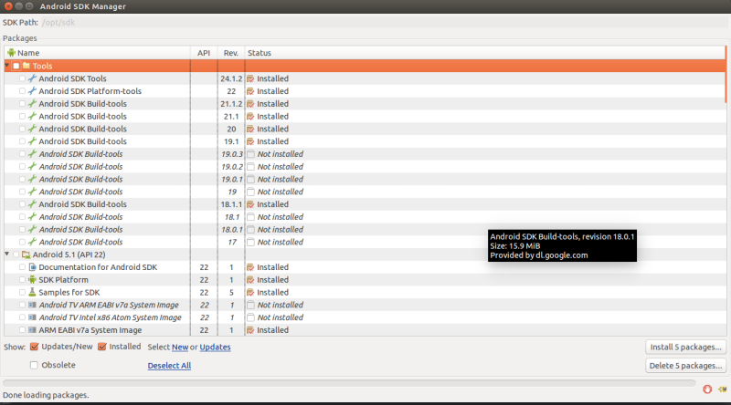
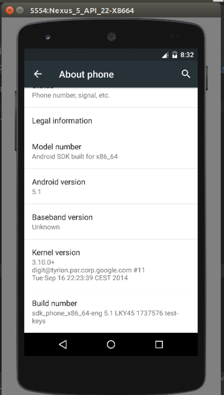
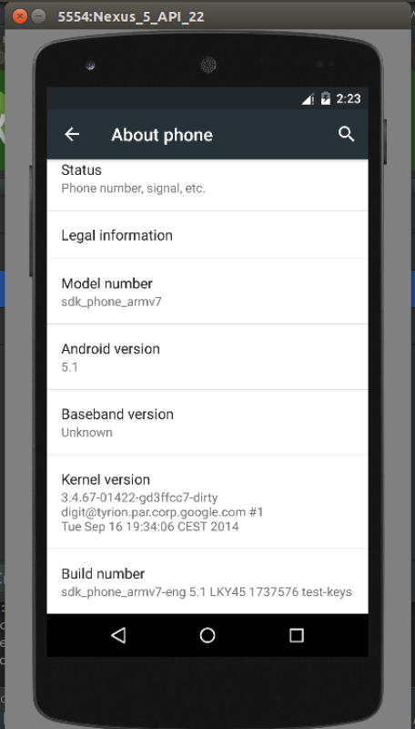
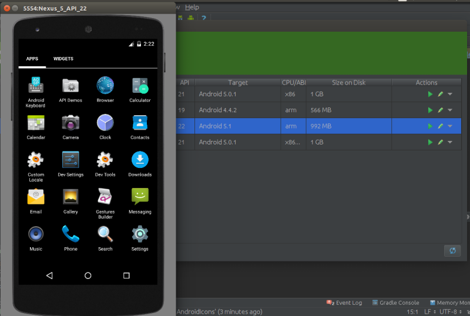
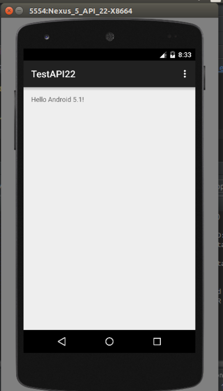

# [Android 实战技巧之二十二：Android 5.1 SDK 下载与配置](http://blog.csdn.net/lincyang/article/details/44680629)

<table class="table table-bordered table-striped table-condensed"> <tr> <td>目录(?)[+]</td> </tr> </table>

## 重要文件下载地址：

（1）[http://dl-ssl.google.com/android/repository/sources-22_r01.zip](http://dl-ssl.google.com/android/repository/sources-22_r01.zip)

（2）[http://dl-ssl.google.com/android/repository/tools_r24.1.2-windows.zip](http://dl-ssl.google.com/android/repository/tools_r24.1.2-windows.zip) 

（3）[http://dl-ssl.google.com/android/repository/android-22_r01.zip](http://dl-ssl.google.com/android/repository/android-22_r01.zip)

（4）[http://dl-ssl.google.com/android/repository/samples-22_r05.zip](http://dl-ssl.google.com/android/repository/samples-22_r05.zip) 

（5）[http://dl-ssl.google.com/android/repository/build-tools_r21.1.2-windows.zip](http://dl-ssl.google.com/android/repository/build-tools_r21.1.2-windows.zip) 

（6）[http://dl-ssl.google.com/android/repository/build-tools_r22-windows.zip](http://dl-ssl.google.com/android/repository/build-tools_r22-windows.zip) 

（7）[http://dl-ssl.google.com/android/repository/build-tools_r22.0.1-windows.zip](http://dl-ssl.google.com/android/repository/build-tools_r22.0.1-windows.zip) 

（8）[http://dl-ssl.google.com/android/repository/docs-22_r01.zip](http://dl-ssl.google.com/android/repository/docs-22_r01.zip) 

（9）[http://dl-ssl.google.com/android/repository/sysimg_x86-22_r01.zip](http://dl-ssl.google.com/android/repository/sysimg_x86-22_r01.zip) 

（10）[http://dl-ssl.google.com/android/repository/sysimg_x86_64-22_r01.zip](http://dl-ssl.google.com/android/repository/sysimg_x86_64-22_r01.zip) 

（11）[http://dl-ssl.google.com/android/repository/sysimg_arm-22_r01.zip](http://dl-ssl.google.com/android/repository/sysimg_arm-22_r01.zip) 

（12）[http://dl-ssl.google.com/android/repository/haxm-windows_r05.3.zip](http://dl-ssl.google.com/android/repository/haxm-windows_r05.3.zip)

按照惯例，linux 版本的只需将上述地址中的 windows 换成 linux 即可。

## SDK 目录结构

```
    :/opt/sdk$ ls
    add-ons  build-tools  docs extras  platforms  platform-tools  samples  sources  system-images  temp  tmp  tools
```

### 1.docs 

只需将原来的 docs 目录重命名，如 docs-21，将最新的 docs-22解压即可。文档是学习 Android 新 feature 的重要途径，一定要重视。
 
### 2.sources 

API 源码，另一个重要的学习资料。将其解压到 sources 目录下，最好将其 api 号标好，比如我这里：

```
    $ ls sources/
    android-14  android-15  android-16  android-17  android-18  android-19  android-21  android-22
```

### 3.samples 

例子是学习的第三个途径。将其放入 samples 目录下即可，如下：

```
    $ ls samples/
    android-10  android-15  android-16  android-17  android-18  android-19  android-5.1
```

### 4.platform
 
这是 sdk 中的核心。将 sources-22_r01.zip 解压到 platforms 目录，如下：

```
    $ ls platforms/
    android-10  android-14  android-15  android-16  android-17  android-18  android-19  android-21  android-5.1  android-L
```

### 5.编译工具 

tools_r24.1.2、build-tools_r22.0.1分别放到 tools 和 build-tools 下。 

### 6.sysimg 

有了5.1的 platform 我们就可以开发5.1的应用了，但是我们还缺少一个模拟器。这是 sysimg 要做的事情。
 
将 sysimg_arm-22_r01.zip 解压到 platform-tools 目录下。

## 第一个 Android5.1 例子

build.gradle 如下：

```
    apply plugin: 'com.android.application'

    android {
        compileSdkVersion 22
        buildToolsVersion "21.1.2"

        defaultConfig {
            applicationId "com.linc.testapi22"
            minSdkVersion 15
            targetSdkVersion 22
            versionCode 1
            versionName "1.0"
        }
        buildTypes {
            release {
                minifyEnabled false
                proguardFiles getDefaultProguardFile('proguard-android.txt'), 'proguard-rules.pro'
            }
        }
    }

    dependencies {
        compile fileTree(dir: 'libs', include: ['*.jar'])
        compile 'com.android.support:appcompat-v7:22.+'
    }
```

演示如下图：

 

 

 

 

 

参考： 

[http://www.cnblogs.com/warnier-zhang/p/4369647.html](http://www.cnblogs.com/warnier-zhang/p/4369647.html) 

[http://www.cnblogs.com/yaotong/archive/2011/01/25/1943615.html](http://www.cnblogs.com/yaotong/archive/2011/01/25/1943615.html)