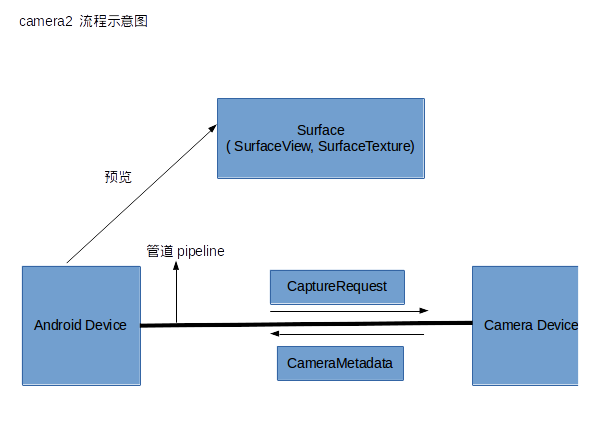
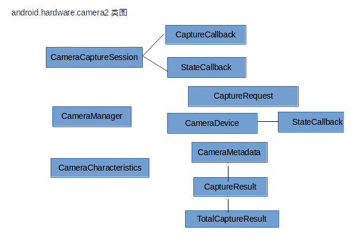
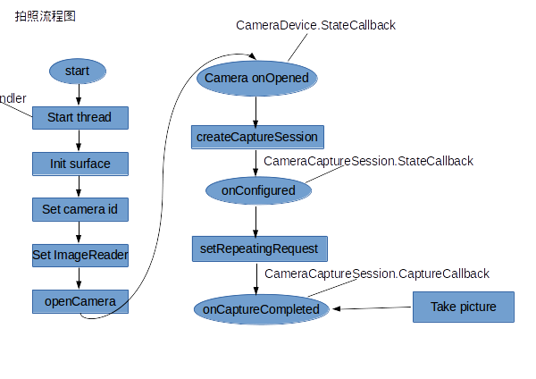
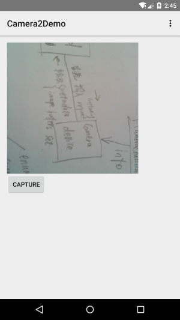

# [Android 实战技巧之三十三：android.hardware.camera2 使用指南](http://blog.csdn.net/lincyang/article/details/45951225)

API 21中将原来的 camera API 弃用转而推荐使用新增的 camera2 API，这是一个大的动作，因为新 API 换了架构，让开发者用起来更难了。
 
先来看看 camera2包架构示意图： 



这里引用了管道的概念将安卓设备和摄像头之间联通起来，系统向摄像头发送 Capture 请求，而摄像头会返回 CameraMetadata。这一切建立在一个叫作 CameraCaptureSession 的会话中。

下面是 camera2包中的主要类：

 

其中 CameraManager 是那个站在高处统管所有摄像投设备（CameraDevice）的管理者，而每个 CameraDevice 自己会负责建立 CameraCaptureSession 以及建立 CaptureRequest。

CameraCharacteristics 是 CameraDevice 的属性描述类，非要做个对比的话，那么它与原来的 CameraInfo 有相似性。 

类图中有着三个重要的 callback，虽然这增加了阅读代码的难度，但是你必须要习惯，因为这是新包的风格。其中 CameraCaptureSession.CaptureCallback 将处理预览和拍照图片的工作，需要重点对待。

这些类是如何相互配合的？下面是简单的流程图。 



我是用 SurfaceView 作为显示对象（当然还可以 TextureView 去显示，详见参考中的项目）
 
核心代码如下：

```
        mCameraManager = (CameraManager) this.getSystemService(Context.CAMERA_SERVICE);
        mSurfaceView = (SurfaceView)findViewById(R.id.surfaceview);
        mSurfaceHolder = mSurfaceView.getHolder();
        mSurfaceHolder.addCallback(new SurfaceHolder.Callback() {
            @Override
            public void surfaceCreated(SurfaceHolder holder) {
                initCameraAndPreview();
            }
        });
```

```
     private void initCameraAndPreview() {
            Log.d("linc","init camera and preview");
            HandlerThread handlerThread = new HandlerThread("Camera2");
            handlerThread.start();
            mHandler = new Handler(handlerThread.getLooper());
            try {
                mCameraId = ""+CameraCharacteristics.LENS_FACING_FRONT;
                mImageReader = ImageReader.newInstance(mSurfaceView.getWidth(), mSurfaceView.getHeight(),
                        ImageFormat.JPEG,/*maxImages*/7);
                mImageReader.setOnImageAvailableListener(mOnImageAvailableListener, mHandler);

                mCameraManager.openCamera(mCameraId, DeviceStateCallback, mHandler);
            } catch (CameraAccessException e) {
                Log.e("linc", "open camera failed." + e.getMessage());
            }
        }
```

```
    private CameraDevice.StateCallback DeviceStateCallback = new CameraDevice.StateCallback() {

            @Override
            public void onOpened(CameraDevice camera) {
                Log.d("linc","DeviceStateCallback:camera was opend.");
                mCameraOpenCloseLock.release();
                mCameraDevice = camera;
                try {
                    createCameraCaptureSession();
                } catch (CameraAccessException e) {
                    e.printStackTrace();
                }
            }
        };
```

```
    private void createCameraCaptureSession() throws CameraAccessException {
            Log.d("linc","createCameraCaptureSession");

            mPreviewBuilder = mCameraDevice.createCaptureRequest(CameraDevice.TEMPLATE_PREVIEW);
            mPreviewBuilder.addTarget(mSurfaceHolder.getSurface());
            mState = STATE_PREVIEW;
            mCameraDevice.createCaptureSession(
                    Arrays.asList(mSurfaceHolder.getSurface(), mImageReader.getSurface()),
                    mSessionPreviewStateCallback, mHandler);
        }
```

```
    private CameraCaptureSession.StateCallback mSessionPreviewStateCallback = new
                CameraCaptureSession.StateCallback() {

            @Override
            public void onConfigured(CameraCaptureSession session) {
                Log.d("linc","mSessionPreviewStateCallback onConfigured");
                mSession = session;
                try {
                    mPreviewBuilder.set(CaptureRequest.CONTROL_AF_MODE,
                          CaptureRequest.CONTROL_AF_MODE_CONTINUOUS_PICTURE);
                    mPreviewBuilder.set(CaptureRequest.CONTROL_AE_MODE,
                           CaptureRequest.CONTROL_AE_MODE_ON_AUTO_FLASH);
                    session.setRepeatingRequest(mPreviewBuilder.build(), mSessionCaptureCallback, mHandler);
                } catch (CameraAccessException e) {
                    e.printStackTrace();
                    Log.e("linc","set preview builder failed."+e.getMessage());
                }
            }
        };
```

```
    private CameraCaptureSession.CaptureCallback mSessionCaptureCallback =
                new CameraCaptureSession.CaptureCallback() {

            @Override
            public void onCaptureCompleted(CameraCaptureSession session, CaptureRequest request,
                                           TotalCaptureResult result) {
    //            Log.d("linc","mSessionCaptureCallback, onCaptureCompleted");
                mSession = session;
                checkState(result);
            }

            @Override
            public void onCaptureProgressed(CameraCaptureSession session, CaptureRequest request,
                                            CaptureResult partialResult) {
                Log.d("linc","mSessionCaptureCallback,  onCaptureProgressed");
                mSession = session;
                checkState(partialResult);
            }

            private void checkState(CaptureResult result) {
                switch (mState) {
                    case STATE_PREVIEW:
                        // NOTHING
                        break;
                    case STATE_WAITING_CAPTURE:
                        int afState = result.get(CaptureResult.CONTROL_AF_STATE);

                        if (CaptureResult.CONTROL_AF_STATE_FOCUSED_LOCKED == afState ||
                             CaptureResult.CONTROL_AF_STATE_NOT_FOCUSED_LOCKED == afState
                                ||  CaptureResult.CONTROL_AF_STATE_PASSIVE_FOCUSED == afState
                                || CaptureResult.CONTROL_AF_STATE_PASSIVE_UNFOCUSED == afState) {
                            //do something like save picture
                        }
                        break;
                }
            }

        };
```

按下 capture 按钮：

```
    public void onCapture(View view) {
        try {
            Log.i("linc", "take picture");
            mState = STATE_WAITING_CAPTURE;
            mSession.setRepeatingRequest(mPreviewBuilder.build(), mSessionCaptureCallback, mHandler);
        } catch (CameraAccessException e) {
            e.printStackTrace();
        }
    }
```

测试用 genemotion 模拟器，直接调用笔记本的摄像头。 

配置图如下： 


demo 界面如下图：



源码：
 
请参考 github 中的两个 demo 项目： 

[https://github.com/pinguo-yuyidong/Camera2](https://github.com/pinguo-yuyidong/Camera2) 

[https://github.com/googlesamples/android-Camera2Basic](https://github.com/googlesamples/android-Camera2Basic)