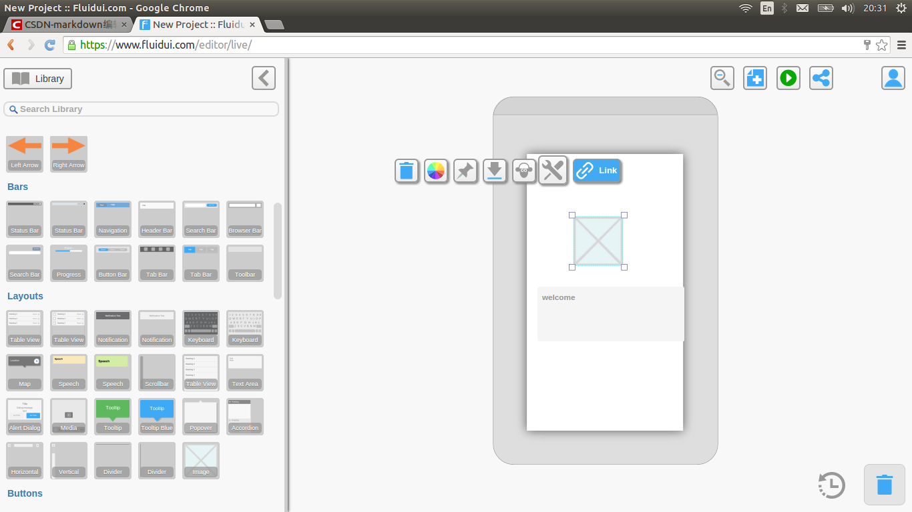
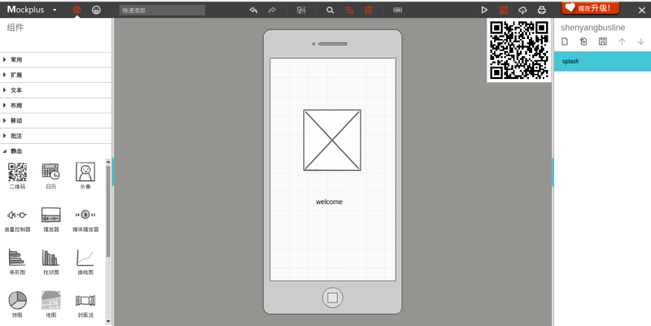
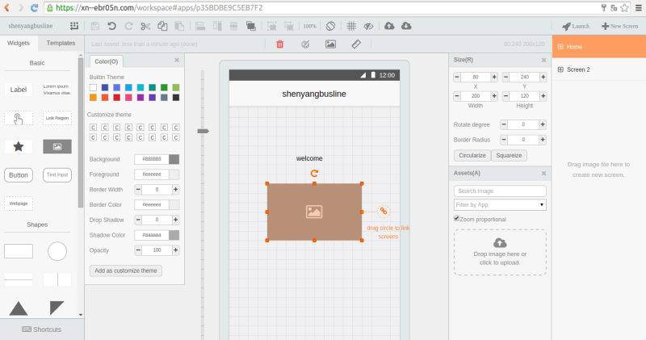

# [Android 实战技巧之二十一：Android 原型设计工具探索](http://blog.csdn.net/lincyang/article/details/44568493)

移动开发者、移动产品经理和交互设计师在有了产品的想法后会做出一系列的草图，然后反复推敲改进，直到自己满意。这个草图就是原型设计，是产品设计初期很重要的工作，它是产品的雏形，之后会以此为原型进行开发。

当移动互联网热度增加后，一些主打移动原型设计的工具如雨后春笋般冒了出来。在我看来，一个好的工具对产品还是帮助很大的，但遗憾的是，绝大多数的工具都是收费的。 

下面列出我试用的工具。 

## 1.[fluidui](https://www.fluidui.com/)

界面还是很炫的，用户体验确实不错。免费用户的限制是只能创建一个项目并且只有10个屏幕。收费版还是很贵的说，Lite 版12刀一个月，pro 版49刀一个月。 

## 2.[justinmind](https://www.justinmind.com/) 

产品也很好，只不过桌面版没有 Linux 的，真不好意思。
 
## 3.pencil 

几年前这个开源工具还很火，13年后就没有更新了，更遗憾的是源代码放在 code.google 上管理。我很想得到这个工具，因为这是免费的工具，功能也足够我用。 

## 4.[mockplus](https://www.mockplus.cn/) 

摩客，一个国产软件。界面风格不错。免费版的局限是你的设计是公开的，这对于大部分用户来说是不可接受的。所以，付费版是必须。 

## 5.[modao](https://modao.io/) 

墨刀，另一个国产软件。用户体验不错，缺点同上。 

## 总结
 
鉴于自己的需求不高，觉得还是没有必要每个月花钱购置收费版。手绘是个不错的选择！当时就是这样！