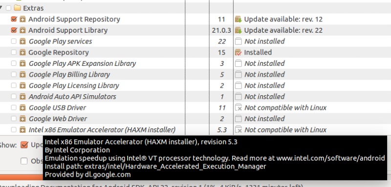
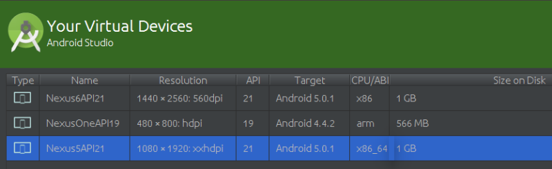
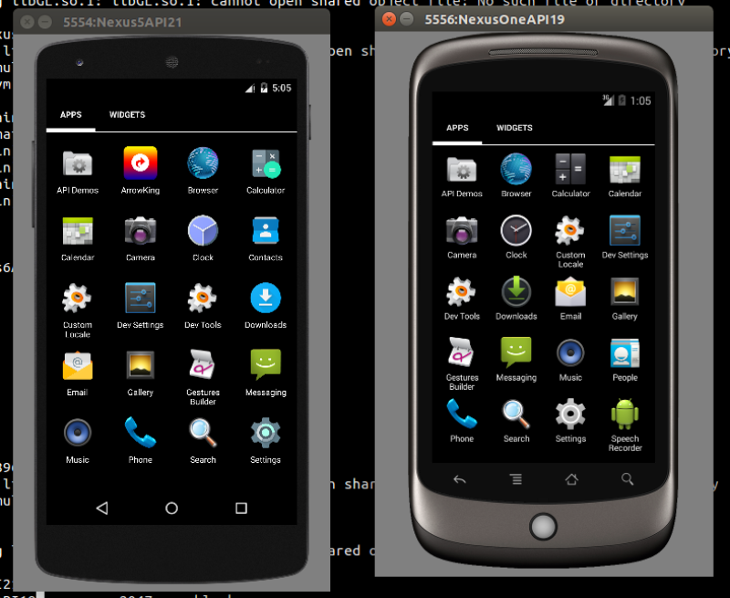

#[Android 实战技巧之十七：Linux 下的模拟器硬件加速](http://blog.csdn.net/lincyang/article/details/44408529)

[`硬件加速`](http://www.csdn.net/tag/%e7%a1%ac%e4%bb%b6%e5%8a%a0%e9%80%9f) [`androidstu`](http://www.csdn.net/tag/androidstu) [`HAXM`](http://www.csdn.net/tag/HAXM) [`kvm`](http://www.csdn.net/tag/kvm)

Intel 提供了一个叫HAXM 的虚拟硬件加速技术，全称为：Intel Hardware Accelerated Execution Manager. 

只要你的 CPU 是 intel 的产品并且支持 VT（virtualization Technology）就可以使用 HAXM 技术将你的模拟器的速度提升至真机的水平。目前此技术支持苹果的 Mac 系统和 Windows 系统，但 Linux 平台不在此列。 



要知道 Android 的编译环境 Google 首推 Linux 平台（64 位的Ubuntu）而 Mac 系统排到第二位。那么在 Linux 平台下是如何硬件加速的呢？ 

那就是传说中的 kvm（Kernel-based Virtual Machine），同样的，它需要硬件的支持，比如 intel 的 VT 和 AMD 的 V，它是基于硬件的完全虚拟化。 

首先要确定你的 cpu 满足要求，下面有几个命令可以参考：

```

    $ egrep -c '(vmx|svm)' /proc/cpuinfo
    4

```

打印的值不为 0 即可。

下面安装 kvm：

```

    $ sudo apt-get install qemu-kvm
    $ sudo adduser linc kvm
    $ sudo apt-get install libvirt-bin ubuntu-vm-builder  bridge-utils
    $ sudo adduser linc libvirtd

```

检验安装是否成功：

```

    $ sudo virsh -c qemu:///system list
     Id    Name                           State
    ----------------------------------------------------

```

一切顺利，接下来要创建 x86 或 x86_64 的模拟器，其他模拟器不支持。如下图： 



用命令行启动此模拟器：

```

    $ /opt/sdk/tools/emulator -avd Nexus5API21 -qemu -m 2047 -enable-kvm

```



使用起来果然飞快，连打开网页的速度都令人惊奇。当然了，如果不用命令行启动，直接在 Android Studio 中启动 x86_64 架构的模拟器，速度也是很快，唯独 arm 架构的模拟器启动速度奇慢无比。话又说回来，既然有了比较不错的 cpu，那么机器的其他配置一定差不了，这样的配置跑起模拟器来肯定要比原来强。

模拟器顺手了，下面就尽情享受开发的乐趣吧。 

如果觉得用自带的模拟器不能够满足你的要求，那么可以使用第三方的模拟器 [Genymotion](https://www.genymotion.com/#!/),网传开发者反应良好。

参考：
 
[http://www.mobibrw.com/?p=291](http://www.mobibrw.com/?p=291)