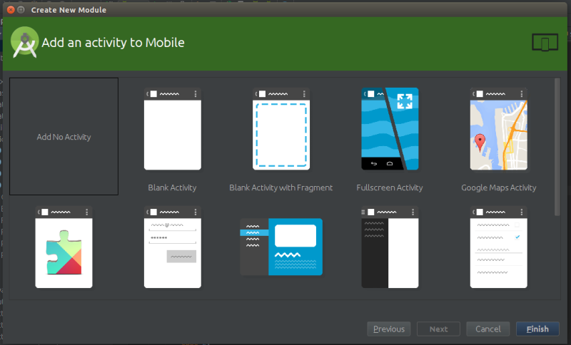

# [Android 实战技巧之十九：android studio 导出 jar 包（Module）并获得手机信息](http://blog.csdn.net/lincyang/article/details/44457799)

AS 中并没有独立的 Module 工程，但是可以在普通的 Project 中加入 Module。所谓的 Module 就是我们通常所指的模块化的一个单元，并常常以 jar 包的形式存在。下面以一个获取手机信息的例子演示 AS 中的模块化。

## 一、项目中新建 Module

File—>New Module，详细见下图。 




## 二、新建 Java 类

新建一个 PhoneInfo 类，内容如下：

```
    package com.linc.mylibrary;

    import android.content.Context;
    import android.net.wifi.WifiInfo;
    import android.net.wifi.WifiManager;
    import android.os.Build;
    import android.telephony.TelephonyManager;
    import android.text.format.Formatter;
    import android.util.Log;
 
    import java.io.BufferedReader;
    import java.io.FileReader;
    import java.io.IOException;

    /** 
     * Created by linc on 15-3-19.
     */
    public class PhoneInfo {
        private String TAG = "PhoneInfo";
        private Context mContext;
        private TelephonyManager mPhoneManager;
 
        public PhoneInfo(Context context) {
            mContext = context;
            mPhoneManager = (TelephonyManager)mContext.getSystemService(Context.TELEPHONY_SERVICE);
        }
   
        public String getDeviceId() {
            return mPhoneManager.getDeviceId();
        }

        public String getPhoneModule() {
            return Build.MODEL;
        }

        public String getSerialNumber() {
            return Build.SERIAL;
        }

        public String getPhoneNumber() {
            return mPhoneManager.getLine1Number();
        }

        public String getMacAddress(){
            String result = "";
            WifiManager wifiManager = (WifiManager) mContext.getSystemService(Context.WIFI_SERVICE);
            WifiInfo wifiInfo = wifiManager.getConnectionInfo();
            result = wifiInfo.getMacAddress();
            Log.i(TAG, "macAdd:" + result);
            return result;
        }

        public String[] getCpuInfo() {
            String str1 = "/proc/cpuinfo";
            String str2 = "";
            String[] cpuInfo = {"", ""};  //1-cpu型号  //2-cpu频率
            String[] arrayOfString;
            try {
                FileReader fr = new FileReader(str1);
                BufferedReader localBufferedReader = new BufferedReader(fr, 8192);
                str2 = localBufferedReader.readLine();
                arrayOfString = str2.split("\\s+");
                for (int i = 2; i < arrayOfString.length; i++) {
                    cpuInfo[0] = cpuInfo[0] + arrayOfString[i] + " ";
                }
                str2 = localBufferedReader.readLine();
                arrayOfString = str2.split("\\s+");
                cpuInfo[1] += arrayOfString[2];
                localBufferedReader.close();
            } catch (IOException e) {
            }
            Log.i(TAG, "cpuinfo:" + cpuInfo[0] + " " + cpuInfo[1]);
            return cpuInfo;
        }

        public String getTotalMemory() {
            String str1 = "/proc/meminfo";// 系统内存信息文件
            String str2;
            String[] arrayOfString;
            long initial_memory = 0;

            try {
                FileReader localFileReader = new  FileReader(str1);
                BufferedReader localBufferedReader = new BufferedReader(
                        localFileReader, 8192);
                str2 = localBufferedReader.readLine();// 读取meminfo第一行，系统总内存大小

                arrayOfString = str2.split("\\s+");
                for (String num : arrayOfString) {
                    Log.i(str2, num + "\t");
                }

                initial_memory = Integer.valueOf(arrayOfString[1]).intValue() * 1024;// 获得系统总内存，单位是KB，乘以1024转换为Byte
                localBufferedReader.close();

            } catch (IOException e) {
            }
            return Formatter.formatFileSize(mContext, initial_memory);// Byte转换为KB或者MB，内存大小规格化
        }
    }
```

并在 Module 的 AndroidManifest 文件中加入两个权限：

```
        <uses-permission android:name="android.permission.READ_PHONE_STATE" />
        <uses-permission android:name="android.permission.ACCESS_WIFI_STATE"/>
```

##三、app 中引入此 module

在 app 的 build.gradle 中加入此 module 的 dependency，如下：

```
    dependencies {
        compile 'com.android.support:appcompat-v7:21.0.3'
        compile project(':mylibrary')
    }
```

在 app 的 MainActivity 中加入测试代码：

```
        @Override
        protected void onCreate(Bundle savedInstanceState) {
            super.onCreate(savedInstanceState);
            setContentView(R.layout.activity_main);

            PhoneInfo info = new PhoneInfo(this);
            Log.d(TAG,"devices id: "+info.getDeviceId());
            Log.d(TAG,"getPhoneModule: "+info.getPhoneModule());
            Log.d(TAG,"getSerialNumber: "+info.getSerialNumber());
            Log.d(TAG,"getPhoneNumber: "+info.getPhoneNumber());
            Log.d(TAG,"getMacAddress: "+info.getMacAddress());
            Log.d(TAG,"getCpuInfo: "+info.getCpuInfo());
            Log.d(TAG,"getTotalMemory: "+info.getTotalMemory());
        }
```

##四、jar 的生成

项目编译之后 jar 会在下面的目录找到：

```
    ./mylibrary/build/intermediates/bundles/debug/classes.jar
    ./mylibrary/build/intermediates/bundles/release/classes.jar
```

##五、Module 的移除

先要在 File—>Project Structure 中将此 module“减“掉后才能在项目中 Module 右键的 Delete 键可用。 


参考： 

[http://www.cnblogs.com/wuya/p/android-studio-gradle-export-jar-assets.html](http://www.cnblogs.com/wuya/p/android-studio-gradle-export-jar-assets.html)

[http://www.cnblogs.com/helloandroid/articles/2210334.html](http://www.cnblogs.com/helloandroid/articles/2210334.html)
 
[http://blog.csdn.net/hyr83960944/article/details/37519299](http://blog.csdn.net/hyr83960944/article/details/37519299)