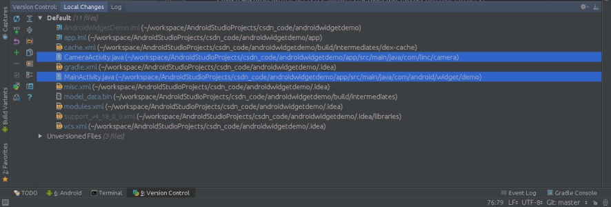
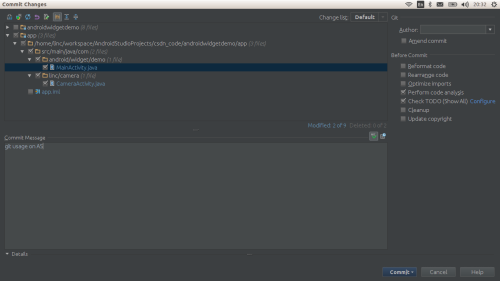

# [Android 实战技巧之三十二：Android Studio 中的源代码管理](http://blog.csdn.net/lincyang/article/details/45795613)

Android Studio 最近经过了两次升级到了 Android Studio 1.2.1.1, 用起来是越来越顺手了。AS 中加入了主流的源码管理工具，让开发者不用离开 AS 就可以提交和管理代码。 

下面就演示一下在 AS 中使用 git 管理代码。  
 
**选择要提交的代码** 

右键—>commit 

**编写 commit message**

可以选择 commit and push 一起完成提交的动作
 
**确认后 push**

 

**查看提交历史和对比文件**

 

总结：
 
玩 git 的都知道在命令行下有些版本历史信息的显示是不方便的，我们需要借助 gitk 等工具来显示图形化的历史信息，而文件对比还需要第三方工具如 meld 等。那么现在 AS 中都有了这些图形化的东西，真的很方便使用。

