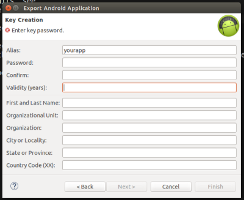
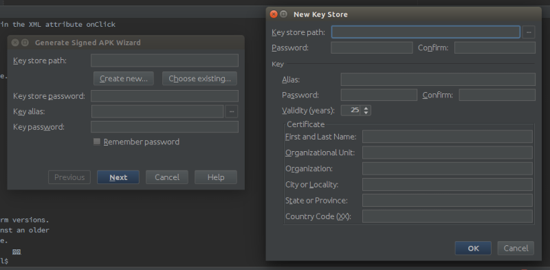

#[Android 实战技巧之十三：APK 签名](http://blog.csdn.net/lincyang/article/details/44017651)

[`android`](http://www.csdn.net/tag/android) [`keystore`](http://www.csdn.net/tag/keystore) [`签名`](http://www.csdn.net/tag/%e7%ad%be%e5%90%8d)

Android 程序要运行就必须有签名。平时我们用的 debug 版是用的 debug 签名，不用我们关心。当我们自己发布程序时，就需要自己的签名了。其实无论用哪个 IDE 开发，最终只是用了 keytool 和 jarsigner 这两个 Java 工具来完成签名任务（在 jdk 的 bin 目录下）。其中 keytool 用来生成 keystore（证书），jarsigner 用来做签名。 

**keytool 用法举例如下：**

```

    keytool -genkey -alias lincapp -keyalg RSA -keysize 1024 -keypass android -validity 365 -keystore lincapp.keystore -storepass android

```

**jarsigner 用法举例如下：**

```

    jarsigner -keystore lincapp.keystore -signedjar lincapp_signed.apk lincapp.apk lincapp

```

其实我们直接使用 IDE 提供的签名功能会更方便一些。 

Eclipse： 

项目右键—>Android Tools—>Export Singed Application Package,简单填写信息就可以了。注意要记住密码。 



Android Studio： 

Build—>Generate Signed APK, 过程与 Eclipse 类似。 



参考： 

[http://www.cnblogs.com/ok-lanyan/archive/2013/04/02/2995462.html](http://www.cnblogs.com/ok-lanyan/archive/2013/04/02/2995462.html)

