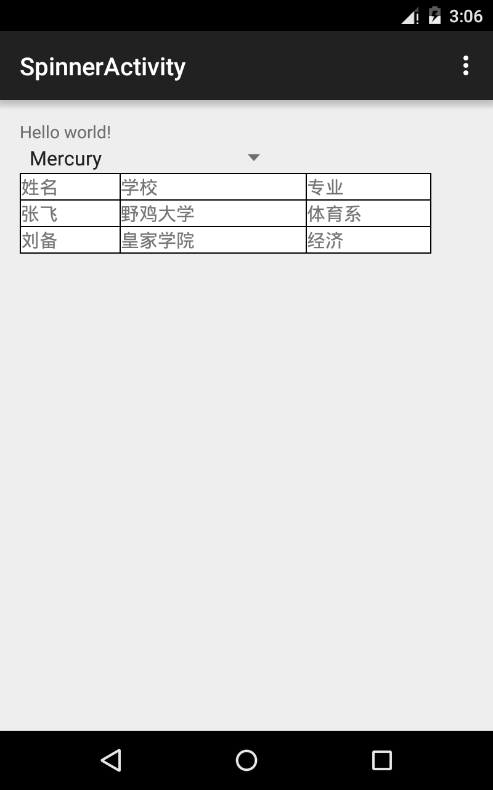
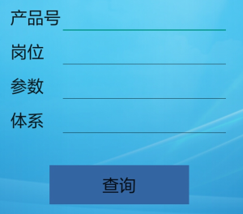

#[Android 实战技巧之三十四：用 TableLayout 伪装表格显示数据](http://blog.csdn.net/lincyang/article/details/46238937)

[`TableLayou`](http://www.csdn.net/tag/TableLayou) [`表格`](http://www.csdn.net/tag/%e8%a1%a8%e6%a0%bc)

先来上个图，最终效果图。 



每个 Layout 都有自己最适用的场景，而 TableLayout 往往用在中规中矩的输入界面，比如下图：



TableLayout 下嵌套 TableRow 组成 Table 的行；每个 TableRow 中布局不同的控件，组成 Table 的列。上图就是两列四行，而我们要做的表格就是三行三列。

TableLayout 是没有提供边框的，要作成表格的效果需要我们使用一些技巧： 

整个 TableLayout 的背景色设成黑色，而每个 Table 的 cell（其实就是每个控件）的背景色设成白色，然后 cell 的边距根据情况设置一个 px，就可以了。 

布局代码如下：

```

    <TableLayout
        android:id="@+id/table"
        android:layout_below="@id/spinner"
        android:layout_width="wrap_content"
        android:background="@color/black"
        android:layout_height="wrap_content">
        <TableRow
            android:layout_marginTop="1dp"
            android:layout_marginRight="1dp"
            android:layout_marginLeft="1dp"
            android:layout_width="wrap_content"
            android:layout_height="wrap_content">
            <TextView android:text="姓名"
                android:textSize="@dimen/table_text_size"
                android:background="@color/white"
                android:layout_width="@dimen/table_item1_width"
                android:layout_height="wrap_content" />
            <TextView android:text="学校"
                android:textSize="@dimen/table_text_size"
                android:background="@color/white"
                android:layout_marginLeft="1dp"
                android:layout_width="@dimen/table_item2_width"
                android:layout_height="wrap_content" />
            <TextView android:text="专业"
                android:textSize="@dimen/table_text_size"
                android:background="@color/white"
                android:layout_marginLeft="1dp"
                android:layout_width="@dimen/table_item3_width"
                android:layout_height="wrap_content" />
        </TableRow>
        <TableRow
            android:layout_marginTop="1dp"
            android:layout_marginBottom="1dp"
            android:layout_marginRight="1dp"
            android:layout_marginLeft="1dp"
            android:layout_width="wrap_content"
            android:layout_height="wrap_content">
            <TextView android:text="张飞"
                android:textSize="@dimen/table_text_size"
                android:background="@color/white"
                android:layout_width="@dimen/table_item1_width"
                android:layout_height="wrap_content" />
            <TextView android:text="野鸡大学"
                android:textSize="@dimen/table_text_size"
                android:background="@color/white"
                android:layout_marginLeft="1dp"
                android:layout_width="@dimen/table_item2_width"
                android:layout_height="wrap_content" />
            <TextView android:text="体育系"
                android:textSize="@dimen/table_text_size"
                android:background="@color/white"
                android:layout_marginLeft="1dp"
                android:layout_width="@dimen/table_item3_width"
                android:layout_height="wrap_content" />
        </TableRow>
        <TableRow
            android:layout_marginBottom="1dp"
            android:layout_marginRight="1dp"
            android:layout_marginLeft="1dp"
            android:layout_width="wrap_content"
            android:layout_height="wrap_content">
            <TextView android:text="刘备"
                android:textSize="@dimen/table_text_size"
                android:background="@color/white"
                android:layout_width="@dimen/table_item1_width"
                android:layout_height="wrap_content" />
            <TextView android:text="皇家学院"
                android:textSize="@dimen/table_text_size"
                android:background="@color/white"
                android:layout_marginLeft="1dp"
                android:layout_width="@dimen/table_item2_width"
                android:layout_height="wrap_content" />
            <TextView android:text="经济"
                android:textSize="@dimen/table_text_size"
                android:background="@color/white"
                android:layout_marginLeft="1dp"
                android:layout_width="@dimen/table_item3_width"
                android:layout_height="wrap_content" />
        </TableRow>
    </TableLayout>

```