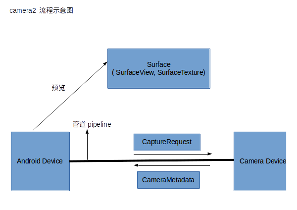
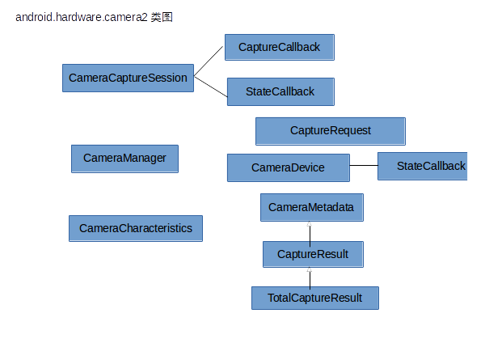
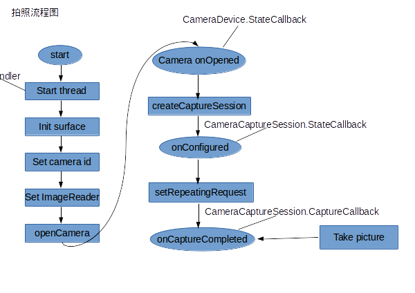
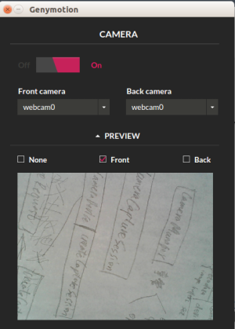
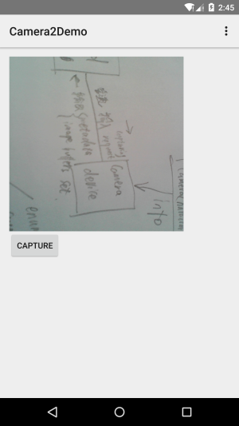

#[Android 实战技巧之三十三：android.hardware.camera2 使用指南](http://blog.csdn.net/lincyang/article/details/45951225)

[`camera2`](http://www.csdn.net/tag/camera2) [`摄像头`](http://www.csdn.net/tag/%e6%91%84%e5%83%8f%e5%a4%b4) [`拍照`](http://www.csdn.net/tag/%e6%8b%8d%e7%85%a7)

API 21 中将原来的 camera API 弃用转而推荐使用新增的 camera2 API，这是一个大的动作，因为新 API 换了架构，让开发者用起来更难了。
 
先来看看 camera2 包架构示意图： 



这里引用了管道的概念将安卓设备和摄像头之间联通起来，系统向摄像头发送 Capture 请求，而摄像头会返回 CameraMetadata。这一切建立在一个叫作 CameraCaptureSession 的会话中。

下面是 camera2 包中的主要类：

 

其中 CameraManager 是那个站在高处统管所有摄像投设备（CameraDevice）的管理者，而每个 CameraDevice 自己会负责建立 CameraCaptureSession 以及建立 CaptureRequest。

CameraCharacteristics 是 CameraDevice 的属性描述类，非要做个对比的话，那么它与原来的 CameraInfo 有相似性。 
类图中有着三个重要的 callback，虽然这增加了阅读代码的难度，但是你必须要习惯，因为这是新包的风格。其中 CameraCaptureSession.CaptureCallback 将处理预览和拍照图片的工作，需要重点对待。

这些类是如何相互配合的？下面是简单的流程图。 



我是用 SurfaceView 作为显示对象（当然还可以 TextureView 去显示，详见参考中的项目）
 
核心代码如下：

```

        mCameraManager = (CameraManager) this.getSystemService(Context.CAMERA_SERVICE);
        mSurfaceView = (SurfaceView)findViewById(R.id.surfaceview);
        mSurfaceHolder = mSurfaceView.getHolder();
        mSurfaceHolder.addCallback(new SurfaceHolder.Callback() {
            @Override
            public void surfaceCreated(SurfaceHolder holder) {
                initCameraAndPreview();
            }
        });

```

```

     private void initCameraAndPreview() {
            Log.d("linc","init camera and preview");
            HandlerThread handlerThread = new HandlerThread("Camera2");
            handlerThread.start();
            mHandler = new Handler(handlerThread.getLooper());
            try {
                mCameraId = ""+CameraCharacteristics.LENS_FACING_FRONT;
                mImageReader = ImageReader.newInstance(mSurfaceView.getWidth(), mSurfaceView.getHeight(),
                        ImageFormat.JPEG,/*maxImages*/7);
                mImageReader.setOnImageAvailableListener(mOnImageAvailableListener, mHandler);

                mCameraManager.openCamera(mCameraId, DeviceStateCallback, mHandler);
            } catch (CameraAccessException e) {
                Log.e("linc", "open camera failed." + e.getMessage());
            }
        }

```

```

    private CameraDevice.StateCallback DeviceStateCallback = new CameraDevice.StateCallback() {

            @Override
            public void onOpened(CameraDevice camera) {
                Log.d("linc","DeviceStateCallback:camera was opend.");
                mCameraOpenCloseLock.release();
                mCameraDevice = camera;
                try {
                    createCameraCaptureSession();
                } catch (CameraAccessException e) {
                    e.printStackTrace();
                }
            }
        };

```

```

    private void createCameraCaptureSession() throws CameraAccessException {
            Log.d("linc","createCameraCaptureSession");

            mPreviewBuilder = mCameraDevice.createCaptureRequest(CameraDevice.TEMPLATE_PREVIEW);
            mPreviewBuilder.addTarget(mSurfaceHolder.getSurface());
            mState = STATE_PREVIEW;
            mCameraDevice.createCaptureSession(
                    Arrays.asList(mSurfaceHolder.getSurface(), mImageReader.getSurface()),
                    mSessionPreviewStateCallback, mHandler);
        }

```

```

    private CameraCaptureSession.StateCallback mSessionPreviewStateCallback = new
                CameraCaptureSession.StateCallback() {

            @Override
            public void onConfigured(CameraCaptureSession session) {
                Log.d("linc","mSessionPreviewStateCallback onConfigured");
                mSession = session;
                try {
                    mPreviewBuilder.set(CaptureRequest.CONTROL_AF_MODE,
                          CaptureRequest.CONTROL_AF_MODE_CONTINUOUS_PICTURE);
                    mPreviewBuilder.set(CaptureRequest.CONTROL_AE_MODE,
                           CaptureRequest.CONTROL_AE_MODE_ON_AUTO_FLASH);
                    session.setRepeatingRequest(mPreviewBuilder.build(), mSessionCaptureCallback, mHandler);
                } catch (CameraAccessException e) {
                    e.printStackTrace();
                    Log.e("linc","set preview builder failed."+e.getMessage());
                }
            }
        };

```

```

    private CameraCaptureSession.CaptureCallback mSessionCaptureCallback =
                new CameraCaptureSession.CaptureCallback() {

            @Override
            public void onCaptureCompleted(CameraCaptureSession session, CaptureRequest request,
                                           TotalCaptureResult result) {
    //            Log.d("linc","mSessionCaptureCallback, onCaptureCompleted");
                mSession = session;
                checkState(result);
            }

            @Override
            public void onCaptureProgressed(CameraCaptureSession session, CaptureRequest request,
                                            CaptureResult partialResult) {
                Log.d("linc","mSessionCaptureCallback,  onCaptureProgressed");
                mSession = session;
                checkState(partialResult);
            }

            private void checkState(CaptureResult result) {
                switch (mState) {
                    case STATE_PREVIEW:
                        // NOTHING
                        break;
                    case STATE_WAITING_CAPTURE:
                        int afState = result.get(CaptureResult.CONTROL_AF_STATE);

                        if (CaptureResult.CONTROL_AF_STATE_FOCUSED_LOCKED == afState ||
                             CaptureResult.CONTROL_AF_STATE_NOT_FOCUSED_LOCKED == afState
                                ||  CaptureResult.CONTROL_AF_STATE_PASSIVE_FOCUSED == afState
                                || CaptureResult.CONTROL_AF_STATE_PASSIVE_UNFOCUSED == afState) {
                            //do something like save picture
                        }
                        break;
                }
            }

        };

```

按下 capture 按钮：

```

    public void onCapture(View view) {
        try {
            Log.i("linc", "take picture");
            mState = STATE_WAITING_CAPTURE;
            mSession.setRepeatingRequest(mPreviewBuilder.build(), mSessionCaptureCallback, mHandler);
        } catch (CameraAccessException e) {
            e.printStackTrace();
        }
    }

```

测试用 genemotion 模拟器，直接调用笔记本的摄像头。 

配置图如下： 



demo 界面如下图：



源码：
 
请参考 github 中的两个 demo 项目： 

[https://github.com/pinguo-yuyidong/Camera2](https://github.com/pinguo-yuyidong/Camera2) 

[https://github.com/googlesamples/android-Camera2Basic](https://github.com/googlesamples/android-Camera2Basic)