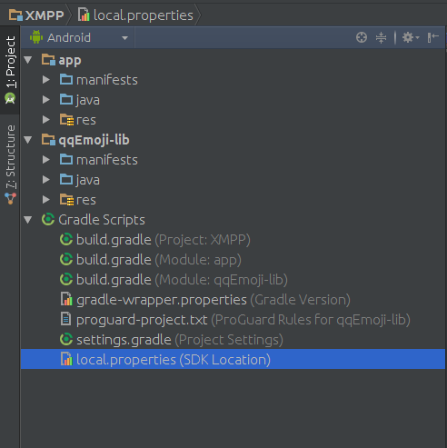
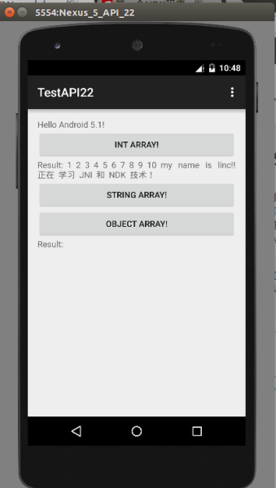

#[Android 实战技巧之十二：Android Studio 导入第三方类库、jar 包和 so 库](http://blog.csdn.net/lincyang/article/details/43951527)

[`android-studio`](http://www.csdn.net/tag/android-studio) [`类库`](http://www.csdn.net/tag/%e7%b1%bb%e5%ba%93) [`jar包`](http://www.csdn.net/tag/jar%e5%8c%85) [`so库`](http://www.csdn.net/tag/so%e5%ba%93)

<table class="table table-bordered table-striped table-condensed"> <tr> <td>目录(?)[+]</td> </tr> </table>

##第三方类库源码

将一网友的 XMPP 代码从 ADT 转到 AS 时，发现其使用了第三方类库，源码放在了 lib 下，直接在 AS 中 Import project，第三方类库并没有自动导入进来，看来需要自己动手了。

项目的目录结构如下：

```

    XMPP$ ls
    app    build.gradle  gradlew      import-summary.txt  XMPP.iml
    build  gradle        gradlew.bat  local.properties    settings.gradle

```

将第三方源码 qqEmoji-lib 拷到此目录，修改 settings.gradle 增加此 lib：

```

    include ':app',':qqEmoji-lib'

```

修改 app 下的 build.gradle，在 dependencies 内加入：

```

    dependencies {
        compile project(':qqEmoji-lib')
        ...

```

在 qqEmoji-lib下 新建 build.gradle 文件，内容参考如下：

```

    apply plugin: 'android-library'

    android {
        compileSdkVersion 19
        buildToolsVersion "21.1.2"

        defaultConfig {
            minSdkVersion 8
            targetSdkVersion 18
        }

        sourceSets {
            main {
                manifest.srcFile 'AndroidManifest.xml'
                java.srcDirs = ['src']
                resources.srcDirs = ['src']
                aidl.srcDirs = ['src']
                renderscript.srcDirs = ['src']
                res.srcDirs = ['res']
            }
        }
    }

    dependencies {
        compile 'com.android.support:appcompat-v7:19.1.0'
        //compile 'com.android.support:support-v4:19.1.0'
    }

```

gradle 的配置内容情参考最后第二个链接。

此时项目的结构见下图： 



此时编译，通过，导入成功！

##第三方类库 jar 包

这就简单多了，直接将 jar 包拷贝到 app/libs 下，然后在 app 下的 build.gradle 中添加此 jar 的依赖。如下：

```

    dependencies {
        compile 'com.android.support:support-v4:19.1.0'
        compile files('libs/libammsdk.jar')
        compile files('libs/universal-image-loader-1.8.6-with-sources.jar')
       compile files('libs/YoumiSdk_v5.00_2015-01-08.jar')
    }

```

##第三方 so 库

通常来说，我们调用第三方的 so 库是不需要额外工作的，只需将其放入指定目录，然后在 Java 文件中 load 即可。 

比如我引用之前《第一个 NDK 程序》中编译出的 libFirstLib.so，将其放到 app/src/main/jniLibs/armeabi/ 下，在源码中引用：

```

    static {  
    System.loadLibrary("FirstLib"); 
    }  

```

即可。程序运行如下图： 



参考：
 
[http://www.cnblogs.com/neozhu/p/3458759.html](http://www.cnblogs.com/neozhu/p/3458759.html)

[http://www.open-open.com/lib/view/open1415793464648.html](http://www.open-open.com/lib/view/open1415793464648.html)
