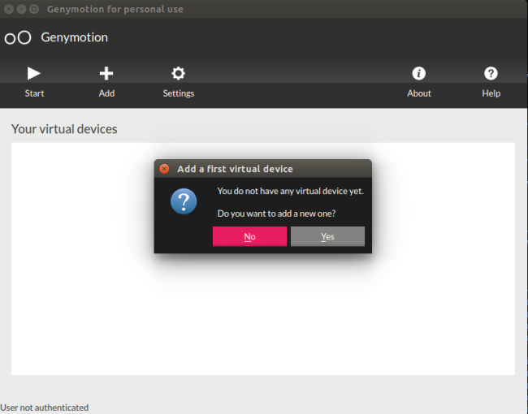
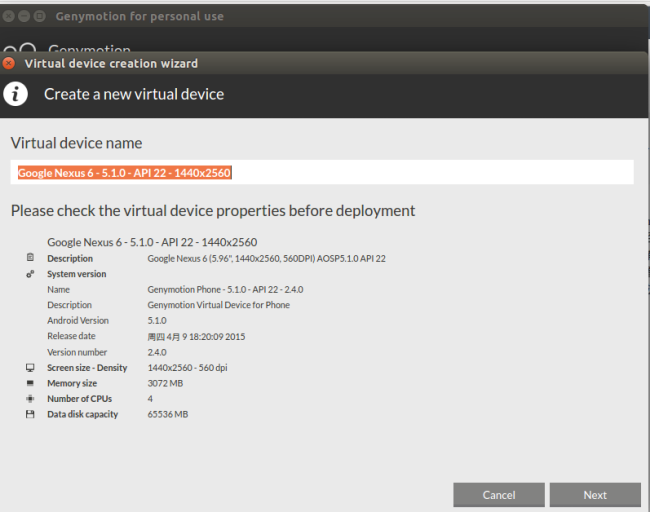
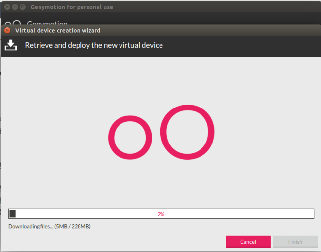
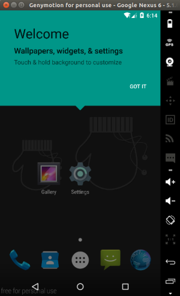
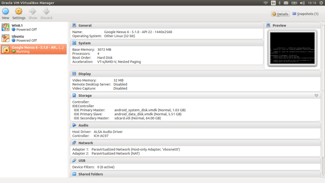

#[Android 实战技巧之二十五：模拟器如何重启？试试 Genymotion！](http://blog.csdn.net/lincyang/article/details/45270721)

[`genymotion`](http://www.csdn.net/tag/genymotion) [`模拟器重启`](http://www.csdn.net/tag/%e6%a8%a1%e6%8b%9f%e5%99%a8%e9%87%8d%e5%90%af) [`第三方模拟器`](http://www.csdn.net/tag/%e7%ac%ac%e4%b8%89%e6%96%b9%e6%a8%a1%e6%8b%9f%e5%99%a8)

需要测试 Android 5.1 系统重启后的一个功能，我手里的设备都没有这么高的版本，那么只好向模拟器求助了。就像大多网友一样，我遇到了一个大问题，如何将 Android 模拟器重启？ 

我有几个想法：
 
* 长按模拟器的 power kay，调出重启键。可惜的是系统默认只有poweroff 一项。 

* adb reboot 或者 adb shell 进入模拟器再执行 reboot。尝试了几个模拟器，都没有成功，只听见我本子的 cpu 风扇在飞速的运转着。
 
* 自己写一个重启的小应用做重启这件事。这是几年前我就想写的程序了，可惜 Android 并没有放开接口。普通应用做不到。

就这样，几个点子都点不亮，怎么办呢？那就试试第三方的模拟器 Genymotion 吧！下面就是我抱着试试看的态度，一步一步走下去，没想到有个完美的结局。

Genymotion是一个口碑非常好的第三方Android模拟器，不过要使用高级的功能是要包月花钱的，如果只是基本的测试要求，免费的个人版也能帮上忙。官网是 [https://www.genymotion.com/](https://www.genymotion.com/) ，下载和使用需要先注册帐号。

起初我以为口碑这么好的工具，安装应该事件非常 easy 的事，但没想到我安装遇到了很多问题。

需要先安装 virtualbox.这个当然是越新越好，我之前安装的 4.3.26 足够用。版本过低是无法使用或效率有问题。ubuntu 下用 dpkg 安装 deb 包即可。

注册帐号，并下载相应的 bin 包。（这个 bin 包当时我还真不清楚如何处理，最后问网友才知道是可执行的） 

我的系统是 ubuntu14.04，下载后执行：

```

    $ ./genymotion-2.4.0_x64.bin

```

生成 genymotion 文件夹，里面的内容如下：

```

    $ ls genymotion
    crypto                      lib64OpenglRender.so  libQtWebKit.so.4
    device-upgrade              libavutil.so.51       libQtXml.so.4
    genymotion                  libcrypto.so           libssl.so
    genymotion-shell            libprotobuf.so.7      libswscale.so.2
    genymotion-tool             libqca.so.2           player
    genyshell                   libQtCore.so.4        plugins
    icons                       libQtGui.so.4         sqldrivers
    imageformats                libQtNetwork.so.4      tools
    lib64EGL_translator.so      libQtScript.so.4      translations
    lib64GLES_CM_translator.so  libQtSql.so.4
    lib64GLES_V2_translator.so  libQtSvg.so.4

```

执行

```

    genymotion$ ./genymotion

```

报错说 virtualbox engine not load. 

解决如下：

```

    $ /etc/init.d/vboxdrv status
    VirtualBox kernel module is not loaded.
    $ sudo /etc/init.d/vboxdrv setup
    [sudo] password for linc: 
    Stopping VirtualBox kernel modules ...done.
    Recompiling VirtualBox kernel modules ...done.
    Starting VirtualBox kernel modules ...done.
    $ /etc/init.d/vboxdrv status
    VirtualBox kernel modules (vboxdrv, vboxnetflt, vboxnetadp, vboxpci) are loaded.

```

这次再执行./genymotion就会正常启动了。 



然后进入到添加设备阶段，需要登录，就遇到“genymotion unknown generic error“了。真是够不幸的，一天时间就要这么浪费下去吗？我还能否顺利的使用你呢？ 

也许是网络的问题，官网都非常慢。想登录一下也没有反显，用户体验真是不太好。 

这个错误并不是网上说的那样需要设置 vitualbox 里设置虚拟机的网络配置，因为现在我们还没有任何虚拟机。这只是一个普通的网络原因造成的连接中断，多尝试几次没准就登录上去了。我试了超过 5 次才行。 

登录后会出现可以下载的设备列表，我选择了 6 儿子，系统信息如下图： 



接下来就是下载的过程，个人感觉速度还可以。 



那么启动这个模拟器看看吧！速度真是没得说，十分迅速！ 



右侧是一些功能列表，但好多功能只有付费才能用。
 
现在咱们再看看 virtualbox 里是否也有这个虚拟机呢？如下图： 



终于成功的启动期待的模拟器了，赶快尝试一下 reboot 十分好用。当然是用命令行来了，adb reboot 和 adb shell 后执行 reboot 都可以成功的将模拟器重启。 

漂亮！下面就可以用它来测试我要的功能了！