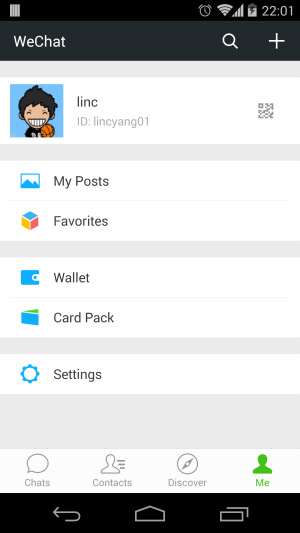
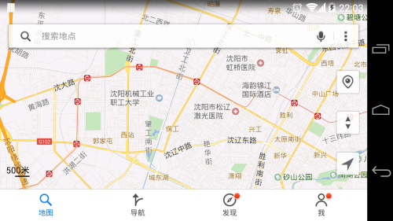
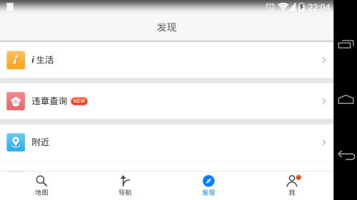

#[Android 实战技巧之二十四：横竖屏切换](http://blog.csdn.net/lincyang/article/details/45117249)

[`横竖屏切换`](http://www.csdn.net/tag/%e6%a8%aa%e7%ab%96%e5%b1%8f%e5%88%87%e6%8d%a2) [`数据保存`](http://www.csdn.net/tag/%e6%95%b0%e6%8d%ae%e4%bf%9d%e5%ad%98) [`onSaveInst`](http://www.csdn.net/tag/onSaveInst)

<table class="table table-bordered table-striped table-condensed"> <tr> <td>目录(?)[+]</td> </tr> </table>

这几年一直在做手机上和电视盒的 App，几乎没有考虑过横竖屏切换的问题。电视盒好说，横屏不变，你要是给它设计个竖屏人家也没机会使；而手机上的应用就不好说了，有些界面你设计了横竖屏兼容可能是为了表示你的功能强大。但是按照惯例，或许也是设计师图省事，我们只是做一个方案。就像目前主流的 App 都只有竖屏一个模式，比如微信、京东和招商银行。我截了几张图表示一下。 




但是像地图之类的应用，也许横屏会显示的更友好一些。请看腾讯地图的设计如下：





细心的你会发现，地图的横竖屏的样式几乎是一样的布局，调整起来还是比较容易的。我一直也这样认为，横竖屏切换就是一件十分 Easy 的事儿，但现在我不这样认为了。

因为我可是思考在 Android 平板上的界面设计了。屏幕大了，横竖屏可以提供不同的表现形式。这是平板与手机的区别。但这样一来，事情就会变得不那么简单了。尤其是大量信息录入的界面，后台有线程工作的时候，都是很难办的事儿。下面是我的一些探索，希望大家多提意见。

##生命周期的故事

横竖屏切换的过程，会经历 onDestroy 和 onCreate。通俗点说，就是这个 activity 关闭了，有新起来一个 activity。那么，前一个 activity 的数据肯定都不存在了。虽然这样的切换，你的 EditText 上输入的内容还在，但是一定要记得，成员变量都是空的啦。数据保存成了一个问题。

##保存整个 activity 的方案

在 Manifest 里对于的 activity 加上这个配置就不会重走销毁和创建了，如下：

```

    android:configChanges="orientation|keyboardHidden|screenSize"

```

不要高兴的太早，除非你不需要改变横竖屏的布局，否则这个方案仍然要有很多工作要做。

##还是乖乖的保存数据吧

onRetainNonConfigurationInstance() 被弃用了，我们还是用 onSaveInstanceState 吧。针对横竖屏不同的布局，我们只需在创建一个 layout-land 文件夹，里面放同名的布局文件，onCreate 时会自动加载相对应的横竖屏布局。 

在横竖屏切换的过程中会经历 onSaveInstanceState，给你一个保存数据的机会：

```

        @Override
        public void onSaveInstanceState(Bundle outState) {
        Log.i("linc", "onSaveInstanceState(Bundle)");
            super.onSaveInstanceState(outState);

            outState.putString(TEXT_ONE, ""+editText1.getTag(R.id.tag_first));//avoid   null point
    //        outState.putSerializable();//object
        }

```

在 onCreate 中把数据取出来：

```

        @Override
        protected void onCreate(Bundle savedInstanceState) {
            super.onCreate(savedInstanceState);
            setContentView(R.layout.activity_land_port_switch);
            Log.e("linc","oncreate");
            editText1 = (EditText)findViewById(R.id.txt1);
                    // Restore saved state.
            if (savedInstanceState != null) {            editText1.setTag(R.id.tag_first,savedInstanceState.getString(TEXT_ONE));
            }
            }

```

##github 上的一个进度条例子

请看这个例子吧，横竖屏切换可以有自己的布局，切换过程中不会打断进度条的工作，用到了 Fragment。详情请见这里： 

[https://github.com/alexjlockwood/worker-fragments](https://github.com/alexjlockwood/worker-fragments)

