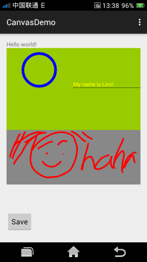

#[Android 实战技巧之二十九：画布 Canvas](http://blog.csdn.net/lincyang/article/details/45557953)

[`android`](http://www.csdn.net/tag/android) [`canvas`](http://www.csdn.net/tag/canvas) [`安卓画板`](http://www.csdn.net/tag/%e5%ae%89%e5%8d%93%e7%94%bb%e6%9d%bf) [`graphic`](http://www.csdn.net/tag/graphic)

<table class="table table-bordered table-striped table-condensed"> <tr> <td>目录(?)[+]</td> </tr> </table>

Android Framework 提供了一些 2D 画图的 API，android.graphics 包就是其中之一。 

为了画一些东西，需要 4 个元素（或称组件）协同来完成： 

* 位图：Bitmap 来保持（hold）那些像素 

* 画布：Canvas 来响应画画（draw）的调用（并将其写入 bitmap）

* 画笔：paint 描述画画的颜色和样式等 
 
* “颜料“：drawing primitive，比如矩形、路径、文字、位图等其他元素

而这其中 Canvas 是比较重要的一环，今天就来演示 Canvas 的基本使用方法。

##一、基本的 draw 方法

android.graphics.Canvas 类提供了很多“画“的方法，让这块画布具有了丰富多彩的画画能力。比如：画点、线、矩形、椭圆、圆、文字等等。下面的例子演示了这些方法的使用。 

先来建一个类，继承自 View。让画布铺在 View 上而显示出来（这也是自定义 UI 组件的路子）。 

重载 onDraw 方法，让这些画画的步骤在 onDraw 中完成。
 
源码如下：

```

    package com.lazytech.canvasdemo;
    public class PaintBoard extends View {

        public PaintBoard(Context context, AttributeSet attrs) {
            super(context, attrs);
        }

        @Override
        protected void onDraw(Canvas canvas) {
            super.onDraw(canvas);

            //paint a circle
            Paint paint = new Paint();
            paint.setColor(Color.BLUE);
            paint.setStyle(Paint.Style.STROKE);
            paint.setStrokeWidth(10);
            canvas.drawCircle(120, 80, 60, paint);

            //paint string
            paint = new Paint();
            paint.setColor(Color.YELLOW);
            paint.setTextSize(20);
            canvas.drawText("My name is Linc!",245,140,paint);

            //draw line
            paint = new Paint();
            paint.setColor(Color.BLACK);
            canvas.drawLine(245,145,500,145,paint);
        }
    }

```

只要在 Activity 的布局文件中加上这个 view 就可以了。如下：

```

    <com.lazytech.canvasdemo.PaintBoard
        android:id="@+id/paint_board"
        android:layout_width="match_parent"
        android:layout_below="@id/text"
        android:layout_height="200dp"
        android:background="@android:color/holo_green_light"
        />

```

##二、一个画板

有了上面的基础，我们就可以发挥一下，写一个画板的 demo。随着手指的滑动，屏幕上留下了你艺术的痕迹。那么这个画板要如何实现呢？
 
有几个点要抓住： 

* 捕捉你手指的滑动轨迹。重载 onTouchEvent 方法来实现。 
 
* 实时更新你的画图。用 invalidate 方法来通知 onDraw 重绘。 

* 保存我们的作品。将 bitmap 保存成文件。

有了上述要点整理，我们开始工作吧。首先还是建一个画板类 PaintBoard2 继承自 View。三个重要元素作为类成员并在构造函数中做初始化。

```

    public class PaintBoard2 extends View {
        private Paint mPaint = null;
        private Bitmap mBitmap = null;
        private Canvas mBitmapCanvas = null;
            public PaintBoard2(Context context, AttributeSet attrs) {
            super(context, attrs);
            mBitmap = Bitmap.createBitmap(500,200, Bitmap.Config.ARGB_8888);
            mBitmapCanvas = new Canvas(mBitmap);
            mBitmapCanvas.drawColor(Color.GRAY);
            mPaint = new Paint();
            mPaint.setColor(Color.RED);
            mPaint.setStrokeWidth(6);
        }

```

随着手指滑动去画线：

```

    private float startX;
    private float startY ;
    @Override
    public boolean onTouchEvent(MotionEvent event) {

        switch (event.getAction()) {
            case MotionEvent.ACTION_DOWN:
                startX = event.getX();
                startY = event.getY();
                break;
            case MotionEvent.ACTION_MOVE:
                float stopX = event.getX();
                float stopY = event.getY();
                Log.e(TAG,"onTouchEvent-ACTION_MOVE\nstartX is "+startX+
                " startY is "+startY+" stopX is "+stopX+ " stopY is "+stopY);
                mBitmapCanvas.drawLine(startX, startY, stopX, stopY, mPaint);
                startX = event.getX();
                startY = event.getY();
                invalidate();//call onDraw()
                break;
        }
        return true;
    }

```

在 onDraw 时画 bitmap：

```

    @Override
    protected void onDraw(Canvas canvas) {
        if(mBitmap != null) {
            canvas.drawBitmap(mBitmap, 0, 0, mPaint);
        }
    }

```

提供一个将 bitmap 存入 OutputStream 的方法供保存位图做准备。

```

    public void saveBitmap(OutputStream stream) {
        if (mBitmap != null) {
            mBitmap.compress(Bitmap.CompressFormat.JPEG, 100, stream);
        }
    }

```

它是如何在 Activity 中调用的呢？ 

activity 的 layout：

```

    <com.lazytech.canvasdemo.PaintBoard2
        android:id="@+id/paint_board2"
        android:layout_below="@id/paint_board"
        android:layout_width="match_parent"
        android:layout_height="200dp" />
    <Button
        android:id="@+id/btn_save"
        android:text="Save"
        android:layout_below="@id/paint_board2"
        android:onClick="OnSaveClicked"
        android:layout_width="wrap_content"
        android:layout_height="wrap_content" />

```

定义 PaintBoard2 作为 Activity 的成员，并在 onCreate 初始化：

```

    private PaintBoard2 paintBoard2;
        @Override
        protected void onCreate(Bundle savedInstanceState) {
            super.onCreate(savedInstanceState);
            setContentView(R.layout.activity_main);
            paintBoard2 = (PaintBoard2)findViewById(R.id.paint_board2);
        }

```

点击保存按钮的处理：

```

    public void OnSaveClicked(View view) {
        try {
            File file = new File(Environment.getExternalStorageDirectory(),
                    System.currentTimeMillis() + ".jpg");
            OutputStream stream = new FileOutputStream(file);
            paintBoard2.saveBitmap(stream);
            stream.close();
            // send broadcast to Media to update data
            Intent intent = new Intent();
            intent.setAction(Intent.ACTION_MEDIA_MOUNTED);
            intent.setData(Uri.fromFile(Environment
                    .getExternalStorageDirectory()));
            sendBroadcast(intent);

            Toast.makeText(this, "save success", Toast.LENGTH_SHORT).show();
        } catch (Exception e) {
            Toast.makeText(this, "save failed", Toast.LENGTH_SHORT).show();
            e.printStackTrace();
        }

```

截图风采： 



完成源码参考我的开源 demo 项目： 

[https://code.csdn.net/lincyang/androidwidgetdemo](https://code.csdn.net/lincyang/androidwidgetdemo)

参考：
 
[http://www.cnblogs.com/menlsh/archive/2012/11/18/2776003.html](http://www.cnblogs.com/menlsh/archive/2012/11/18/2776003.html) 

[http://www.cnblogs.com/wuyou/p/3658691.html](http://www.cnblogs.com/wuyou/p/3658691.html)