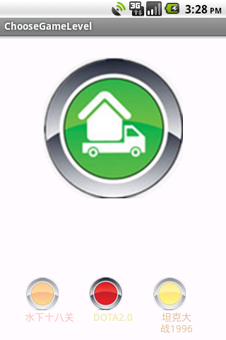

#[Android 实战技巧之二：组合控件](http://blog.csdn.net/lincyang/article/details/7421734)

[`android`](http://www.csdn.net/tag/android) [`image`](http://www.csdn.net/tag/image) [`layout`](http://www.csdn.net/tag/layout) [`encoding`](http://www.csdn.net/tag/encoding) [`button`](http://www.csdn.net/tag/button)

组合控件是自定义控件的一种，只不过它是由其他几个原生控件组合而成，故名组合控件。

在实际项目中，GUI 会遇到一些可以提取出来做成自定义控件情况。

一个自定义控件的好处就是把一些需要模块化的 UI 和逻辑放在一起，做到了高内聚，向其他模块提供接口并很少依赖外界，这样就是低耦合。一个自定义控件就是一个封闭的王国，这里由你掌控。

上述是我自己的一个体会，想必大家也会常做自定义控件吧，就像逻辑部分的模块化一样。

下面我要做一个例子，请看完成图。



下面一排图片加文字就是组合控件了，我是怎么做的呢？

其实这里用到了两个组合控件，一个是图片+文字，我把它叫一个 Item，而三个在一起就是另一个控件了。

重点看这个 Item，它有自己的属性如图片、文字、图片大小、文字大小、不透明度等等。这些把它定义在 attr 文件中，然后在 xml 文件中配置，就像我们用原生控件一样。

先看 attr 文件。

```

    <?xml version="1.0" encoding="utf-8"?>  
    <resources>  
            <declare-styleable name="LevelMenuItem">  
            <attr name="text" format="string" />  
            <attr name="text_color" format="color"/>  
            <attr name="text_size" format="dimension" />          
            <attr name="image_src" format="reference"/>  
            <attr name="image_bg" format="reference"/>  
            <attr name="image_alpha" format="integer" />  
            <attr name="image_height" format="dimension"></attr>  
            <attr name="image_width" format="dimension" />  
        </declare-styleable>  
    </resources>  

```

这个文件在 values 下，和 string 文件同级。把你自己要定义的属性都写在这里吧。format 是属性的“单位”，如果你要问有多少中 format 呀？答案在[这里](http://blog.csdn.net/lincyang/article/details/7421757)。

有了属性了，下面看看布局文件 level_menu_item.xml。

```

    <?xml version="1.0" encoding="utf-8"?>  
    <LinearLayout xmlns:android="http:// schemas.android.com/apk/res/android"  
        android:layout_width="fill_parent"  
        android:layout_height="fill_parent"  
        android:orientation="vertical" >  
            <ImageView  
                android:id="@+id/image_item"  
                android:layout_width="fill_parent"  
                android:layout_height="fill_parent"  
                android:scaleType="fitCenter"  
                />  
             <TextView  
                android:id="@+id/tv_item"  
                android:layout_width="fill_parent"  
                android:layout_height="wrap_content"  
                android:gravity="center_horizontal"  
                android:textColor="#23ffffff"  
                android:textSize="25sp"   
             />      
    </LinearLayout>  

```

这里唯一值得一说的是文本的颜色。大家看见他是 8 位的，前两位是表示不透明度的，后六位是表示颜色的，三色，范围都是 00～ff。

如果在 Java 中设置颜色，需要这样。

```

    setTextColor(0x23ffffff);  

```

关于不透明度，一般美工会定义。有些要求不透明如 30% 这样的，可以用整型换算一下。00～ff 对应十进制为 0～255，那么 30% 就是255x0.3=76.5，用科学计算机换算为 4c。

更多颜色相关请看[《Android 中设置文本颜色的三种办法》](http://blog.csdn.net/lincyang/article/details/5871117)

然后我们就要写一个类，我这继承子线性布局。有两个构造函数，我们主要在两个参数的函数中工作。

```

    public class LevelMenuItem extends LinearLayout {  
      
        public LevelMenuItem(Context context, AttributeSet attrs) {  
            super(context, attrs);  
          
        }  

```

这个类中我们要完成的工作是，初始化控件属性、提供外部修改属性的接口、控件点击的回调接口。 

此类完整代码：

```

    package com.linc.game;  
  
    import android.content.Context;  
    import android.content.res.TypedArray;  
    import android.util.AttributeSet;  
    import android.view.LayoutInflater;  
    import android.view.View;  
    import android.widget.ImageView;  
    import android.widget.LinearLayout;  
    import android.widget.TextView;  
    /** 
     * 自定义一个关卡 
     * 共有7个属性，看attr文件 
     * 在程序中提供修改这7个属性的接口， 
     * 一个自定义控件的任务就算完成。 
     * 一个自定义控件的好处就是把一些需要模块化的 
     * UI和逻辑放在一起，做到了高内聚，向其他模块提供接口并很少 
     * 依赖外界，这样就是低耦合。一个自定义控件就是一个封闭的王国， 
     * 这里由你掌控。 
     *  
     * 编写时，如果遇到在attr里写好属性，但是在这里认不出来， 
     * 就clean一下项目。切记。 
     *  
     * @author linc 
     * 
     */  
    public class LevelMenuItem extends LinearLayout {  
        private TextView mTextView = null;  
        private ImageView mImageView = null;  
      
        public LevelMenuItem(Context context) {  
            super(context);  
        }  
        public LevelMenuItem(Context context, AttributeSet attrs) {  
            super(context, attrs);  
          
            LayoutInflater layoutInflater = (LayoutInflater) context.  
                            getSystemService(Context.LAYOUT_INFLATER_SERVICE);  
            layoutInflater.inflate(R.layout.level_menu_item, this);  
            
            TypedArray typedArray = context.obtainStyledAttributes(attrs  
                    ,R.styleable.LevelMenuItem);  
          
            initWidget(typedArray);  
        }  
        private void initWidget(TypedArray typedArray)  
        {  
            mTextView = (TextView)findViewById(R.id.tv_item);  
            String textString = typedArray.getString(R.styleable.LevelMenuItem_text);  
            int textColor = typedArray.getColor(R.styleable.LevelMenuItem_text_color,  
                    0xffffffff);  
            float textSize = typedArray.getDimension(R.styleable.LevelMenuItem_text_size,  
                    20);  
            mTextView.setText(textString);  
            mTextView.setTextColor(textColor);  
            mTextView.setTextSize(textSize);  
          
            mImageView = (ImageView)findViewById(R.id.image_item);  
            int imageHeight = (int) typedArray.getDimension(R.styleable.LevelMenuItem_image_height, 25);  
            int imageWidth = (int) typedArray.getDimension(R.styleable.LevelMenuItem_image_width, 25);  
            int imageSrc = typedArray.getResourceId(R.styleable.LevelMenuItem_image_src, 0);  
            int imageBg = typedArray.getResourceId(R.styleable.LevelMenuItem_image_bg, 0);  
            int imageAlpha = typedArray.getInt(R.styleable.LevelMenuItem_image_alpha, 255);  
            mImageView.setAlpha(imageAlpha);  
            mImageView.setImageResource(imageSrc);  
            mImageView.setBackgroundResource(imageBg);  
            LayoutParams layoutParams = new LayoutParams(imageWidth, imageHeight);  
            mImageView.setLayoutParams(layoutParams);  
          
            typedArray.recycle();  
        }  
        /** 
         * 设置此控件的文本 
         * @param text 
         */  
        public void setText(String text)  
        {  
            mTextView.setText(text);  
        }  
        /** 
         * 设置文字颜色 
         * @param textColor 
         */  
         public void setTextColor(int textColor)  
        {  
            mTextView.setTextColor(textColor);  
        }  
        /** 
         * 设置字体大小 
         * @param textSize 
         */  
         public void setTextSize(int textSize)  
        {  
            mTextView.setTextSize(textSize);  
        }  
        /** 
         * 设置图片 
         * @param resId 
         */  
         public void setImageResource(int resId)  
        {  
            mImageView.setImageResource(resId);  
        }  
        /** 
         * 设置图片背景 
         */  
         public void setBackgroundResource(int resId)  
        {  
            mImageView.setBackgroundResource(resId);  
        }     
        /** 
         * 设置图片的不透名度 
         * @param alpha 
         */  
        public void setImageAlpha(int alpha)  
        {  
            mImageView.setAlpha(alpha);  
        }  
        /** 
         * 设置图片的大小 
         * 这里面需要使用LayoutParams这个布局参数来设置 
         * @param width 
         * @param height 
         */  
        public void setImageSize(int width,int height)  
        {  
            LayoutParams layoutParams = new LayoutParams(width, height);  
            mImageView.setLayoutParams(layoutParams);  
        }  
        /** 
         * image点击事件的回调 
         * @param listener 
         */  
        public void setOnClickListener(OnItemClickListener listener)  
        {  
            mImageView.setOnClickListener(new View.OnClickListener() {  
                @Override  
                public void onClick(View v) {  
                    listener.onImageClick();  
                }  
            });  
        }  
        /** 
         * 点击事件接口 
         * @author linc 
         * 
         */  
        public interface OnItemClickListener  
        {  
            public void onImageClick();  
        }  
    }  

```

好，一个完整的组合控件就做好了，那么，我们如何使用呢？

我要在 LevelMenu 中用它。xml 文件如下：

```

    <?xml version="1.0" encoding="utf-8"?>  
    <LinearLayout xmlns:android="http://schemas.android.com/apk/res/android"  
        xmlns:linc="http://schemas.android.com/apk/res/com.linc.game"  
        android:layout_width="fill_parent"  
        android:layout_height="fill_parent"  
        android:orientation="horizontal">      
        <com.linc.game.LevelMenuItem  
            android:id="@+id/item1"  
            android:layout_width="70dp"  
            android:layout_height="80dp"  
            linc:text="@string/item1"  
            linc:text_size="14sp"  
            linc:text_color="#80fa8072"  
            linc:image_src="@drawable/orange_button_selector"  
            linc:image_alpha="128"  
            linc:image_height="48dp"  
            linc:image_width="48dp"  
            />  
        <com.linc.game.LevelMenuItem  
            android:id="@+id/item2"  
            android:layout_marginLeft="20dp"  
            android:layout_width="70dp"  
            android:layout_height="80dp"  
            linc:text="@string/item2"  
            linc:text_size="14sp"  
            linc:text_color="#ffeee8aa"  
            linc:image_src="@drawable/red_button_selector"  
            linc:image_alpha="255"  
            linc:image_height="48dp"  
            linc:image_width="48dp"  
            />     
        <com.linc.game.LevelMenuItem  
            android:id="@+id/item3"  
            android:layout_marginLeft="20dp"  
            android:layout_width="70dp"  
            android:layout_height="80dp"  
            linc:text="@string/item3"  
            linc:text_size="14sp"  
            linc:text_color="#80cd853f"               linc:image_src="@drawable/yellow_button_selector"  
            linc:image_alpha="128"  
            linc:image_height="48dp"  
            linc:image_width="48dp"  
            />         
    </LinearLayout>  

```

加入自己包名的索引

```

    xmlns:linc="http://schemas.android.com/apk/res/com.linc.game"  

```

剩下的就一目了然了。

LevelMenu.java

```

    package com.linc.game;  
  
    import com.linc.game.LevelMenuItem.OnItemClickListener;  
    import android.content.Context;  
    import android.util.AttributeSet;  
    import android.util.Log;  
    import android.view.LayoutInflater;  
    import android.widget.LinearLayout;  
  
    public class LevelMenu extends LinearLayout {  
        private LevelMenuItem item1,item2,item3;  
      
        public LevelMenu(Context context) {  
            super(context);  
          
        }  
  
      
        public LevelMenu(Context context, AttributeSet attrs) {  
            super(context, attrs);  
            LayoutInflater layoutInflater = (LayoutInflater) context.  
                getSystemService(Context.LAYOUT_INFLATER_SERVICE);  
            layoutInflater.inflate(R.layout.level_menu, this);  
            initWidget();  
        }  
        private void initWidget()  
        {  
            item1 = (LevelMenuItem)findViewById(R.id.item1);  
            item2 = (LevelMenuItem)findViewById(R.id.item2);  
            item3 = (LevelMenuItem)findViewById(R.id.item3);  
          
            item1.setOnClickListener(new OnItemClickListener() {  
                @Override  
                public void onImageClick() {  
                    Log.e("dfjdkfjd","dfdfd");  
                }  
            });  
        }  
    }  

```

在处理图片点击事件的时候，我用到了选择器（selector），这是我们实际开发中最常用的小技巧了。它能描述的状态很多，各位看官可以去查查。

```

    <?xml version="1.0" encoding="utf-8"?>  
    <selector xmlns:android="http://schemas.android.com/apk/res/android" >  
        <item android:state_pressed="true"  
            android:drawable="@drawable/button_push"/>  
        <item android:drawable="@drawable/orange_button"/>  
    </selector>  

```

好，组合控件的例子先到这里，实际功能在下一个实战技巧中演练。

大家在做自定义控件时需要注意的是：

1、自定义控件类不能是是抽象类

2、要用

```

(Context context, AttributeSet attrs)  

```

这个构造函数

否则报错：android.view.InflateException: Binary XML file line #15: Error inflating cla。。。