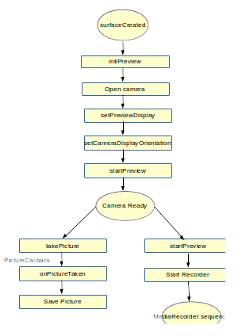

# [Android 实战技巧之三十一：拍照和录像 with Camera](http://blog.csdn.net/lincyang/article/details/45789815)

<table class="table table-bordered table-striped table-condensed"> <tr> <td>目录(?)[+]</td> </tr> </table>

Developer Guides 中有一篇是专门讲 Camera 的，而且讲的特别细。千万别以为有了这么好的文档就可以轻松的使用 android.hardware.Camera 这个包去拍照和录像了，各种坑在前面等着你呢。好了，下面将要讲述我们如何像辽宁队在常规赛中填坑的经历。

## 一、借助 intent

这就十分 easy 了，发个 intent 就有人帮你搞定拍照和录像。 
拍照：

```
    public void onTakePhoto(View view) {
        // create Intent to take a picture and return control to the calling application
        Intent intent = new Intent(MediaStore.ACTION_IMAGE_CAPTURE);

        fileUri = CameraUtils.getOutputMediaFileUri(CameraUtils.MEDIA_TYPE_IMAGE); // create a file to save the image
        intent.putExtra(MediaStore.EXTRA_OUTPUT, fileUri); // set the image file name

        // start the image capture Intent
        startActivityForResult(intent, CAPTURE_IMAGE_ACTIVITY_REQUEST_CODE);
    }
```

录像：

```
    public void onTakeVideo(View view) {
        //create new Intent
        Intent intent = new Intent(MediaStore.ACTION_VIDEO_CAPTURE);

        fileUri = CameraUtils.getOutputMediaFileUri(CameraUtils.MEDIA_TYPE_VIDEO);  // create a file to save the video
        intent.putExtra(MediaStore.EXTRA_OUTPUT, fileUri);  // set the image file name

        intent.putExtra(MediaStore.EXTRA_VIDEO_QUALITY, 1); // set the video image quality to high

        // start the Video Capture Intent
        startActivityForResult(intent, CAPTURE_VIDEO_ACTIVITY_REQUEST_CODE);
    }
```

对结果的处理：

```
    private static final int CAPTURE_IMAGE_ACTIVITY_REQUEST_CODE = 100;
    private static final int CAPTURE_VIDEO_ACTIVITY_REQUEST_CODE = 101;
    @Override
    protected void onActivityResult(int requestCode, int resultCode, Intent data) {
        if (requestCode == CAPTURE_IMAGE_ACTIVITY_REQUEST_CODE) {
            if (resultCode == RESULT_OK) {
                // Image captured and saved to fileUri specified in the Intent
                Toast.makeText(this, "Image saved to:\n" +
                        data.getData(), Toast.LENGTH_LONG).show();
            } else if (resultCode == RESULT_CANCELED) {
                // User cancelled the image capture
            } else {
                // Image capture failed, advise user
            }
        }

        if (requestCode == CAPTURE_VIDEO_ACTIVITY_REQUEST_CODE) {
            if (resultCode == RESULT_OK) {
                // Video captured and saved to fileUri specified in the Intent
                Toast.makeText(this, "Video saved to:\n" +
                        data.getData(), Toast.LENGTH_LONG).show();
            } else if (resultCode == RESULT_CANCELED) {
                // User cancelled the video capture
            } else {
                // Video capture failed, advise user
            }
        }
    }
```

不用上截图了，就是这么简单。

## 二、使用 Camera 编码

按照文档的步骤，最后却没有搞定，真心让我很受伤。经过一周的折腾，最后还是借助网友的力量搞定。 

**需要的权限**

```
        <uses-permission android:name="android.permission.CAMERA" />
        <uses-feature android:name="android.hardware.camera" />
        <uses-feature android:name="android.hardware.camera.autofocus" />
        <uses-permission
         android:name="android.permission.RECORD_AUDIO">
        </uses-permission>
        <uses-permission
          android:name="android.permission.WRITE_EXTERNAL_STORAGE">
        </uses-permission> 
```

**流程** 

简单的流程如下图： 



MediaRecorder 状态图： 


**初始化 SurfaceView 与 SurfaceViewHolder**

```
        @Override
        protected void onCreate(Bundle savedInstanceState) {
            super.onCreate(savedInstanceState);
            setContentView(R.layout.activity_main);

            mSurfaceView = (SurfaceView)findViewById(R.id.surfaceview);
            mSurfaceHolder = mSurfaceView.getHolder();
            mSurfaceHolder.addCallback(new Callback() {
                @Override
                public void surfaceDestroyed(SurfaceHolder holder) {
                    releaseCamera();
                }

                @Override
                public void surfaceCreated(SurfaceHolder holder) {
                    initPreview();
                }

                @Override
                public void surfaceChanged(SurfaceHolder holder, int format, int width,
                        int height) {

                }
            });
    protected void initPreview() {
            mCamera = Camera.open(CameraInfo.CAMERA_FACING_BACK);
            try {
                mCamera.setPreviewDisplay(mSurfaceHolder);
            } catch (IOException e) {
                e.printStackTrace();
            }
            setCameraDisplayOrientation(this,CameraInfo.CAMERA_FACING_BACK,mCamera);
            mCamera.startPreview();
        }

        public static void setCameraDisplayOrientation(Activity activity,
                 int cameraId, android.hardware.Camera camera) {
             android.hardware.Camera.CameraInfo info =
                     new android.hardware.Camera.CameraInfo();
             android.hardware.Camera.getCameraInfo(cameraId, info);
             int rotation = activity.getWindowManager().getDefaultDisplay()
                     .getRotation();
             int degrees = 0;
             switch (rotation) {
                 case Surface.ROTATION_0: degrees = 0; break;
                 case Surface.ROTATION_90: degrees = 90; break;
                 case Surface.ROTATION_180: degrees = 180; break;
                 case Surface.ROTATION_270: degrees = 270;  break;
             }

             int result;
             if (info.facing == Camera.CameraInfo.CAMERA_FACING_FRONT) {
                 result = (info.orientation + degrees) % 360;
                 result = (360 - result) % 360;  //  compensate the mirror
             } else {  // back-facing
                 result = (info.orientation - degrees + 360) % 360;
             }
             camera.setDisplayOrientation(result);
         }
```

**拍照**
 
拍照还是很简单的，实现 PictureCallback 接口：

```
        private Camera.PictureCallback mPicture = new Camera.PictureCallback() {

            @Override
            public void onPictureTaken(byte[] data, Camera camera) {
                Log.d(TAG,"onPictureTaken");
                mPhotoFile = getOutputMediaFile(MEDIA_TYPE_IMAGE);
                if (mPhotoFile == null){
                    Log.d(TAG, "Error creating media file, check storage permissions: ");
                    return;
                }

                try {
                    FileOutputStream fos = new FileOutputStream(mPhotoFile);
                    fos.write(data);
                    fos.close();
                    Log.d(TAG,"save picture success");
                    //notify
                    if (Build.VERSION.SDK_INT >= Build.VERSION_CODES.KITKAT) {
                        Intent mediaScanIntent = new Intent(
                                Intent.ACTION_MEDIA_SCANNER_SCAN_FILE);
                        Uri contentUri = Uri.fromFile(mPhotoFile); //out is your output  file
                        mediaScanIntent.setData(contentUri);
                        MainActivity.this.sendBroadcast (mediaScanIntent);
                    } else {
                        sendBroadcast(new Intent(

                                Intent.ACTION_MEDIA_MOUNTED,
                                Uri.parse("file://"
                                        +     Environment.getExternalStorageDirectory())));
                    }
                    mCamera.reconnect();
                } catch (FileNotFoundException e) {
                    Log.d(TAG, "File not found: " + e.getMessage());
                } catch (IOException e) {
                    Log.d(TAG, "Error accessing file: " + e.getMessage());
                }
            }
        };
```

调用 takePitcture 方法：

```
    public void onPhotoClicked(View view) {
        mCamera.takePicture(null, null, mPicture);
    }
```

**录像**
 
有了上述的准备，启动录像的功能就相对清晰一些，它分为下面的步骤：

```
    private void startMediaRecorder() {
        mCamera.unlock();
        mIsRecording = true;
        mMediaRecorder = new MediaRecorder();
        mMediaRecorder.reset();
        mMediaRecorder.setCamera(mCamera);
        mMediaRecorder.setAudioSource(MediaRecorder.AudioSource.DEFAULT);
        mMediaRecorder.setVideoSource(MediaRecorder.VideoSource.CAMERA);
        CamcorderProfile mCamcorderProfile = CamcorderProfile.get(CameraInfo.CAMERA_FACING_BACK,
                CamcorderProfile.QUALITY_HIGH);
        mMediaRecorder.setProfile(mCamcorderProfile);
        mMediaRecorder.setOutputFile(getOutputMediaFile(MEDIA_TYPE_VIDEO).toString());
        mMediaRecorder.setPreviewDisplay(mSurfaceHolder.getSurface());

        try {
            mMediaRecorder.prepare();
        } catch (Exception e) {
            mIsRecording = false;
            Toast.makeText(this, "fail", Toast.LENGTH_LONG).show();
            e.printStackTrace();
            mCamera.lock();
        }
        mMediaRecorder.start();
    }
```

图片与视频保存的路径：

```
    private File getOutputMediaFile(int type) {
        File mediaStorageDir = new File(Environment.getExternalStoragePublicDirectory(
                Environment.DIRECTORY_PICTURES), "Camera App");
        // This location works best if you want the created images to be shared
        // between applications and persist after your app has been uninstalled.

        // Create the storage directory if it does not exist
        if (! mediaStorageDir.exists()){
            if (! mediaStorageDir.mkdirs()){
                Log.d("linc", "failed to create directory");
                return null;
            }
        }

        // Create a media file name
        String timeStamp = new SimpleDateFormat("yyyyMMdd_HHmmss").format(new Date());
        File mediaFile;
        if (type == MEDIA_TYPE_IMAGE){
            mediaFile = new File(mediaStorageDir.getPath() + File.separator +
                    "IMG_"+ timeStamp + ".jpg");
        } else if(type == MEDIA_TYPE_VIDEO) {
            mediaFile = new File(mediaStorageDir.getPath() + File.separator +
                    "VID_"+ timeStamp + ".mp4");
        } else {
            return null;
        }

        return mediaFile;
    }
```

代码的其余部分：

```
    public static final int MEDIA_TYPE_IMAGE = 1;
    public static final int MEDIA_TYPE_VIDEO = 2;

    private Camera mCamera;
    private SurfaceView mSurfaceView;
    private SurfaceHolder mSurfaceHolder;
    private Button startButton;
    private boolean mIsRecording = false;
    private MediaRecorder mMediaRecorder;
    private File mPhotoFile;
    protected void releaseCamera() {
        if(mCamera!=null){
            mCamera.stopPreview();
            mCamera.release();
            mCamera = null;
        }
    }
        private void stopMediaRecorder() {
        if(mMediaRecorder !=null){
            if(mIsRecording){
                mMediaRecorder.stop();
                //mCamera.lock();
                mMediaRecorder.reset();
                mMediaRecorder.release();
                mMediaRecorder =null;
                mIsRecording = false;
                try {
                    mCamera.reconnect();
                } catch (IOException e) {
                    Toast.makeText(this, "reconect fail", Toast.LENGTH_LONG).show();
                    e.printStackTrace();
                }
            }
        }
    }
```

参考： 

sdk/docs/guide/topics/media/camera.html#custom-camera
 
[http://blog.csdn.net/shen332401890/article/details/8819564](http://blog.csdn.net/shen332401890/article/details/8819564)