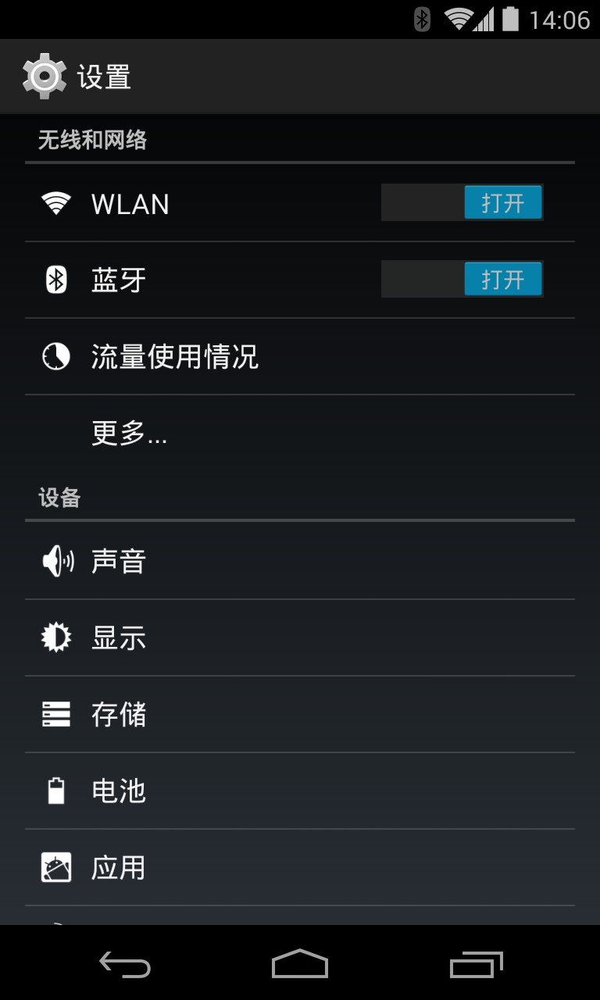

# [Android 实战技巧之六：PreferenceActivity 使用详解](http://blog.csdn.net/lincyang/article/details/20609673)

<table class="table table-bordered table-striped table-condensed"> <tr> <td>目录       (?)[+]</td> </tr> </table>

## 一、写作前面

当我们做应用的时候，需要用户配置一些信息，而这就是通常所说的应用设置。

对于 Android 系统来说，系统本身的设置带来的用户体验和习惯已经深入人心，在我们的应用中同样用到类似的设置页，那么用户使用起来就会更加亲切和方便。是吗？那我们应该怎么做到呢？这就要靠本文的主人公 PreferenceActivity 了。

## 二、设置的细节

打开 Android 手机的设置，如下图：



我们会看到整个页面被分为几组：无线网络、设备、个人、账户和系统。这个分组（或者叫分类）就是 PreferenceCategory。

Wifi 右边有开关，这一项就是 CheckBoxPreference；其他还有 ListPreference 和 EditTextPreference。

你的每一次设置，都会被 Preference 存下来，这就是 setting 的数据持久化。

##三、如何实现自己的设置

下面我们来实现一个设置程序，看看 PreferenceActivity 的基本知识都有哪些。

首先要说的是，PreferenceActivity 从 API level1 中就加入了，那么后续自 Android3.0后有了 Fragment 的概念，同时也带来了 PreferenceFragment，这是后话，今天我们先讲讲简单的。

这个例子有两个 Activity 组成，第一个是 MainAcitivity，程序启动后直接到此，用来现实Setting中的各项设置内容；第二个是 Setting，继承自PreferenceActivity，展示如何设置和数据存储操作等。我只是想演示 PreferenceActivity 相关的知识，UI 是直接托的，layout 中也用了 Hardcode，请看官只是取其精华（如果有的话），去其糟粕。

1.Setting

先来说说重头戏 PreferenceActivity，它并不像普通的 Activity 那样用 layout 来做自己的界面，它是用专属的 xml/preference.xml 来构建自己的界面，然后在类中加入此xml。

本例演示三种常用 preference，如下代码：

preferenc.xml

```
    <?xml version="1.0" encoding="utf-8"?>  
    <PreferenceScreen xmlns:android="http://schemas.android.com/apk/res/android" >  
        <PreferenceCategory android:title="First    Category">  
            <ListPreference  
                android:key="list_key"  
                android:defaultValue="list key default value"  
                android:title="list title"  
                android:summary="list_summary"  
                android:entries="@array/list_preference"  
                android:entryValues="@array/list_preference"  
                android:dialogTitle="list_dialog_title" />       
        </PreferenceCategory>  
        <PreferenceCategory android:title="Second Category">  
            <EditTextPreference  
                android:key="edittext_key"  
                android:defaultValue="edit default value"  
                android:summary="edit summary"  
                android:title="edit title" />  
                <CheckBoxPreference  
                android:key="checkbox_key"  
                android:defaultValue="checkbox default value"  
                android:summary="checkbox summary"  
                android:title="checkbox title"  
                />                
            <EditTextPreference  
                android:key="num_key"  
                android:defaultValue="0"  
                android:summary="edit summary"  
                android:numeric="integer"  
                android:title="input number" />  
     </PreferenceCategory></PreferenceScreen>  
```

我将这三项 preference 分成两组（PreferenceCategory），First Category 和 Second Category.

每一个 Preference 中的都会包含一个 key(android:key)，它的功能相当于普通 layout 中的 id。

title：这一项的标题，字体比较大。

summary：摘要，标题下面的文字，字体较小。

defaultValue：为设置 summary 之前的默认值。

其中数组 list_preference 在 array.xml 中定义：

```
    <?xml version="1.0" encoding="utf-8"?>  
    <resources>  
        <string-array name="list_preference">  
            <item>Red</item>  
            <item>Blue</item>  
            <item>Green</item>    
        </string-array>  
    </resources>  
```

Setting 中是怎样加入这些 UI 信息呢？

```
    public class Setting extends PreferenceActivity implements OnSharedPreferenceChangeListener {  
      
        private EditTextPreference mEtPreference;  
        private ListPreference mListPreference;  
        private CheckBoxPreference mCheckPreference;  
      
        @Override  
        protected void onCreate(Bundle savedInstanceState) {  
            super.onCreate(savedInstanceState);  
  
            addPreferencesFromResource(R.xml.preferences);  
            initPreferences();  
        }  
      
        private void initPreferences() {  
            mEtPreference = (EditTextPreference)findPreference(Consts.EDIT_KEY);  
            mListPreference = (ListPreference)findPreference(Consts.LIST_KEY);  
            mCheckPreference = (CheckBoxPreference)findPreference(Consts.CHECKOUT_KEY);  
        }  
```

此时，这个 setting 类就可以运行起来了。其实就是这么简单。也许你会问，我们设置了自己的偏好值，程序中如何获得呢？

我们需要注册一个 Preference 变化的 Listener 来监听这些事件。当我们做好设置后，Preference 已经替我们做好了数据持久化了。
我们可以用 sharedPreference 来获得这些值。

下面来看：

```
    @Override  
       protected void onResume() {  
           super.onResume();  
  
           // Setup the initial values  
           SharedPreferences sharedPreferences = getPreferenceScreen().getSharedPreferences();  
           mListPreference.setSummary(sharedPreferences.getString(Consts.LIST_KEY, ""));  
           mEtPreference.setSummary(sharedPreferences.getString(Consts.EDIT_KEY, "linc"));  
         
           // Set up a listener whenever a key changes  
           sharedPreferences.registerOnSharedPreferenceChangeListener(this);  
       }  
  
       @Override  
       protected void onPause() {  
           super.onPause();  
           // Unregister the listener whenever a key changes  
           getPreferenceScreen().getSharedPreferences().unregisterOnSharedPreferenceChangeListener(this);  
       }      
     
    @Override  
    public void onSharedPreferenceChanged(SharedPreferences sharedPreferences, String key) {  
           if (key.equals(Consts.EDIT_KEY)) {  
            mEtPreference.setSummary(  
                       sharedPreferences.getString(key, "20"));  
           } else if(key.equals(Consts.LIST_KEY)) {  
            mListPreference.setSummary(sharedPreferences.getString(key, ""));  
           }  
    }  
```

到此，setting 的功能就实现了。那么，在其他 Activity 中如何获得设置的值呢？也是用 sharedPreference 来实现：

看看我的 MainActivity：

```
    package com.linc.howtopreferenceactivity;  
  
    import android.os.Bundle;  
    import android.preference.PreferenceManager;  
    import android.app.Activity;  
    import android.content.Intent;  
    import android.content.SharedPreferences;  
    import android.view.Menu;  
    import android.view.View;  
    import android.view.View.OnClickListener;  
    import android.widget.Button;  
    import android.widget.TextView;  
  
    public class MainActivity extends Activity {  
  
        private Button btnSetting,btnShow;  
        private TextView tvCheckout,tvList,tvEditText;  
      
        @Override  
        protected void onCreate(Bundle savedInstanceState) {  
            super.onCreate(savedInstanceState);  
            setContentView(R.layout.activity_main);  
            initView();  
        }  
  
        private void initView() {  
            btnSetting = (Button)findViewById(R.id.btn_setting);  
            btnShow = (Button)findViewById(R.id.btn_show);  
            btnSetting.setOnClickListener(buttonListener);  
            btnShow.setOnClickListener(buttonListener);  
          
            tvCheckout = (TextView)findViewById(R.id.tv_checkout);  
            tvList = (TextView)findViewById(R.id.tv_list);  
            tvEditText = (TextView)findViewById(R.id.tv_edittext);  
        }  
      
        private OnClickListener buttonListener = new OnClickListener() {  
            @Override  
            public void onClick(View v) {  
                switch(v.getId()) {  
                case R.id.btn_setting:  
                    startActivity(new Intent(MainActivity.this,Setting.class));  
                    break;  
                case R.id.btn_show:  
                    showSettingInfo();  
                    break;  
               }  
           }  
       };  
      
        private void showSettingInfo() {  
            SharedPreferences settings = PreferenceManager.getDefaultSharedPreferences(this);  
            tvCheckout.setText(settings.getBoolean(Consts.CHECKOUT_KEY, false)+"");  
            tvEditText.setText(settings.getString (Consts.EDIT_KEY, ""));  
            tvList.setText(settings.getString(Consts.LIST_KEY, "linc"));  
        }  
       
        @Override  
        public boolean onCreateOptionsMenu(Menu menu) {  
            // Inflate the menu; this adds items to the action bar if it is present.  
            getMenuInflater().inflate(R.menu.main, menu);  
            return true;  
        }  
  
    }  
```

当然，就像用 edit text 一样，我们可以限制输入的是文字还是数字或者是字母。就像上面代码：android:numeric="integer"

完整代码在此：[HowToPreferenceActivity](http://download.csdn.net/detail/lincyang/7002263)