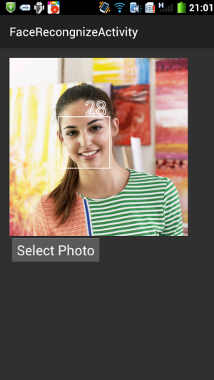

# [Android 实战技巧之三十：人脸检测-静态](http://blog.csdn.net/lincyang/article/details/45625183)

<table class="table table-bordered table-striped table-condensed"> <tr> <td>目录(?)[+]</td> </tr> </table>

最近微软的 how-old.net 把人脸识别技术又大大的火了一把。通过大数据和复杂的算法，能够神奇的预测出照片中人物的性别和年龄。虽然错误率也不低，但是大家都抱着玩一玩乐一乐的心态把照片传上去让机器来鉴定一下自己的颜龄。 


人脸识别算法是高深复杂的，面对着计算机视觉的种种数学公式，我就已经投降了。先来简单的玩玩人脸检测吧。Android 早已提供了 FaceDetector 类，今天就来看看如何使用这个类人脸检测吧。

流程： 

1.打开文件夹选择照片 

2.将照片加载到 bitmap 中并缩放到设置的宽高 

3.用 FaceDetector 来检测人脸，得到 Face 类数组（多人脸检测）
 
4.在照片 bitmap 检测到的人脸上面画上方框和年龄

##一、选择照片

将 Intent 设置 Type 和 Action，启动 activity 选择照片并得到照片的 uri。

```
        Intent intent = new Intent();
        intent.setType("image/*");
        intent.setAction(Intent.ACTION_GET_CONTENT);
        startActivityForResult(intent, OPEN_PHOTO_FOLDER_REQUEST_CODE);
```

##二、加载照片到 bitmap 并缩放

新建一个类 FDView 继承自 View，就像上一篇文章一样，对 bitmap 的修改用到了 canvas 的知识。 

有两种办法将照片加载到 bitmap 中：
 
1.通过 uri 用 stream 的方式

```
    public void initBitmap(Uri uri,int width,int height) {
        try {
            ContentResolver resolver = mContext.getContentResolver();
            BitmapFactory.Options options = new BitmapFactory.Options();
            options.inPreferredConfig = Bitmap.Config.RGB_565;//need this config
            Bitmap bitmap = BitmapFactory.decodeStream(resolver.openInputStream(uri), null, options);
            mBitmap = ThumbnailUtils.extractThumbnail(bitmap, width, height);//scale the bitmap
            detectFace();
        } catch (Exception ex) {
            Log.e(TAG,"exception: "+ex.getMessage());
        }
    }
```

2.用照片的真实路径加载 

获得真实路径：

```
        private void initFRViewWithPath(Uri uri) {
            String[] projection =   {MediaStore.Images.Media.DATA};
    //        Cursor cursor = managedQuery(uri, projection, null, null, null);//deprecated
            CursorLoader cursorLoader = new CursorLoader(this,uri,projection,null,null,null);
            Cursor cursor = cursorLoader.loadInBackground();
            int column_index = cursor.getColumnIndexOrThrow(MediaStore.Images.Media.DATA);
            cursor.moveToFirst();

            String path = cursor.getString(column_index);
            Log.e(TAG,"real path: "+path);
            mFRView.initBitmap(path,mFRView.getWidth (),mFRView.getHeight());
        }
```

decodeFile：

```
    public void initBitmap(String path,int width,int height) {
        BitmapFactory.Options options = new BitmapFactory.Options();
        options.inPreferredConfig = Bitmap.Config.RGB_565;
        mBitmap = BitmapFactory.decodeFile(path, options);
        mBitmap = ThumbnailUtils.extractThumbnail(mBitmap,width,height);//scale the bitmap
        detectFace();
    }
```

##三、人脸检测

```
    private void detectFace() {
        if(mBitmap != null) {
            mImageWidth = mBitmap.getWidth();
            mImageHeight = mBitmap.getHeight();
            mFaces = new FaceDetector.Face[NUMBER_OF_FACES];
            mFaceDetector = new FaceDetector(mImageWidth, mImageHeight, NUMBER_OF_FACES);
            mNumberOfFaceDetected = mFaceDetector.findFaces(mBitmap, mFaces);
            invalidate();
        }
    }
```

##四、人脸上画框

在 onDraw 中用 canvas 将检测到的人脸画上框并写上年龄。

```
    @Override
    protected void onDraw(Canvas canvas) {
        super.onDraw(canvas);
        if(mBitmap != null) {
            canvas.drawBitmap(mBitmap, 0, 0, null);
            Paint paint = new Paint();
            paint.setColor(Color.WHITE);
            paint.setStyle(Paint.Style.STROKE);
            paint.setStrokeWidth(2);
            paint.setTextSize(50);

            for(int i=0; i < mNumberOfFaceDetected; i++){
                FaceDetector.Face face = mFaces[i];
                PointF pointF = new PointF();
                face.getMidPoint(pointF);
                mEyesDistance = face.eyesDistance();
                canvas.drawRect(
                        (int)(pointF.x - mEyesDistance),
                        (int)(pointF.y - mEyesDistance/2),
                        (int)(pointF.x + mEyesDistance),
                        (int)(pointF.y + mEyesDistance*3/2),
                        paint);
                canvas.drawText("28",pointF.x,pointF.y - mEyesDistance/2-5,paint);
            }
        }
    }
```

最终效果图： 



源码请参考我的开源 demo：[https://code.csdn.net/lincyang/androidwidgetdemo]()