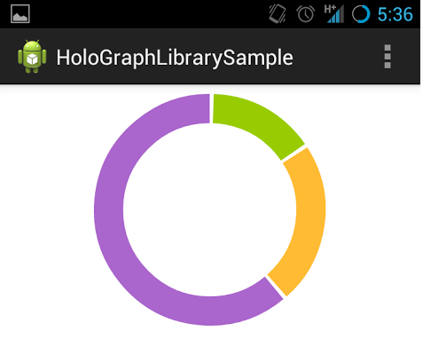
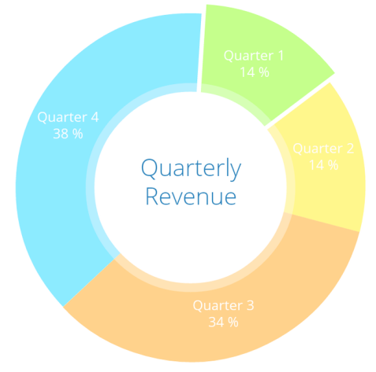

# [Android 实战技巧之二十：两个开源的图表/报表控件](http://blog.csdn.net/lincyang/article/details/44487153)

<table class="table table-bordered table-striped table-condensed"> <tr> <td>目录(?)[+]</td> </tr> </table>

项目中要用饼图和折线图表示数据，重造轮子不是咱风格，先了解一下时下比较流行的开源图表控件吧。调查发现有三个口碑不错的开源项目，它们是 MPAndroidChart、AChartEngine、HoloGraphLibrary。由于 AChartEngine 源码放在 code.google 上，遂先放弃它，主要研究其他两个在 github 上的项目。

## HoloGraphLibrary

项目地址：[https://github.com/Androguide/HoloGraphLibrary](https://github.com/Androguide/HoloGraphLibrary) 

简介：这是一个十分简单的图表控件，源码量在3千行左右。使用简单，项目自带 sample 作为使用指导。示意图如下： 

## MPAndroidChart

项目地址：[https://github.com/PhilJay/MPAndroidChart](https://github.com/PhilJay/MPAndroidChart)

简介：与 Holo 相比要复杂和强大很多，代码量在4万行左右。不过带的例子有了很好的帮助，我们用起来不算难。饼图带很炫的加载动画，如果对界面要求高交互性好，推荐此控件。示意图如下： 

由于这两个项目都用 AS 开发，对于很多使用 eclipse 的同学转换很不方便，我将 lib 做成 jar 包并提供了 eclipse 的 demo，下载地址在：
 
[http://download.csdn.net/detail/lincyang/8517179](http://download.csdn.net/detail/lincyang/8517179)

